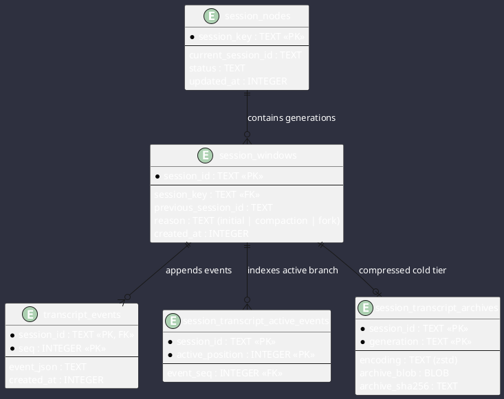
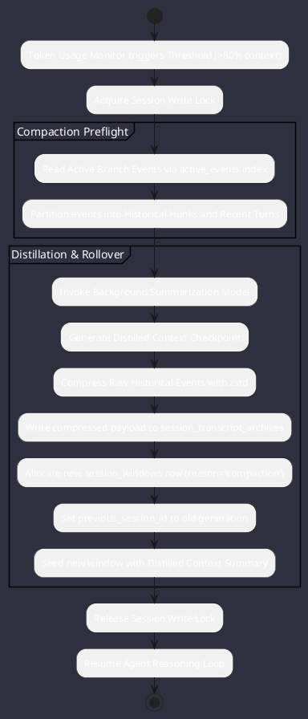

# Comparative Report: Memory, State Persistence & Context Management

**Comparison Subjects**: Google Antigravity SDK, OpenClaw, OpenCode  
**Target Platform**: Omniwrench Java 21 / Spring Boot 3.2+ Architecture  
**Focus Area**: Event-sourced state stores, rolling context compaction, zstd cold-tier archiving, SQLite FTS5 full-text search, and local vector retrieval.

---

## 1. Memory & Storage Architecture Comparison

| Dimension | Google Antigravity SDK | OpenClaw | OpenCode | Omniwrench Target Architecture |
| :--- | :--- | :--- | :--- | :--- |
| **Primary Format** | Append-only JSONL files | SQLite Event Sourcing | SQLite + Flat Files | **SQLite (jOOQ/JDBC) + JSONL** |
| **Generational Epochs**| Compaction markers in list | `session_windows` generations | Context Epochs | **`session_windows` Generational Model** |
| **Active Branch Index**| In-memory step index | `session_transcript_active_events` | SQLite Turn Table | **Active Branch Relational Index** |
| **Cold Archiving** | Retains full JSONL on disk | Compressed zstd BLOBs | Flat file retention | **zstd BLOB Cold-Tier Archive Table** |
| **Text Search** | Line-by-line grep | SQLite FTS5 Virtual Table | In-memory Ripgrep | **SQLite FTS5 Full-Text Engine** |
| **Semantic Recall** | External embeddings | `memory_index_chunks` | Reference Context Index | **Vector Chunks with Provenance Metadata** |

---

## 2. Relational Event-Sourced Storage Model (OpenClaw Pattern)

OpenClaw's SQLite persistence provides ACID-compliant event sourcing, instant point-in-time rewind, and zero-loss compaction:



---

## 3. Rolling Compaction & Context Epoch Lifecycles

When conversation token usage approaches the model context window limit:



---

## 4. Semantic Recall & Provenance Tracking

OpenClaw tracks memory chunk origin classes to prevent untrusted prompt injection into permanent memory:

```sql
CREATE TABLE memory_index_chunk_provenance (
  chunk_id TEXT PRIMARY KEY,
  origin_class TEXT NOT NULL CHECK (origin_class IN ('owner', 'agent', 'untrusted', 'system')),
  session_kind TEXT NOT NULL CHECK (session_kind IN ('interactive', 'cron', 'heartbeat', 'subagent', 'unknown')),
  observed_at INTEGER NOT NULL,
  FOREIGN KEY (chunk_id) REFERENCES memory_index_chunks(id) ON DELETE CASCADE
) STRICT;
```

### Safety Rules:
- **`owner`** / **`system`**: Highest trust; admitted unconditionally.
- **`untrusted`** (scraped web pages, external tool outputs): Tagged as untrusted; never promoted to system instructions without explicit user approval.

---

## 5. Java 21 / Spring Boot 3 Implementation Blueprint for Omniwrench

### 5.1 Event-Sourced Transcript Repository (Spring Data JDBC / SQLite)
```java
package com.omniwrench.persistence;

import com.fasterxml.jackson.databind.ObjectMapper;
import org.springframework.jdbc.core.simple.JdbcClient;
import org.springframework.stereotype.Repository;
import org.springframework.transaction.annotation.Transactional;

import java.time.Instant;
import java.util.List;

@Repository
public class EventSourcedTranscriptRepository {

    private final JdbcClient jdbc;
    private final ObjectMapper mapper = new ObjectMapper();

    public EventSourcedTranscriptRepository(JdbcClient jdbc) {
        this.jdbc = jdbc;
    }

    @Transactional
    public void appendEvent(String sessionId, long seq, Object eventPayload) {
        try {
            String json = mapper.writeValueAsString(eventPayload);
            long now = Instant.now().toEpochMilli();

            // 1. Insert raw event
            jdbc.sql("INSERT INTO transcript_events (session_id, seq, event_json, created_at) VALUES (?, ?, ?, ?)")
                .params(sessionId, seq, json, now)
                .update();

            // 2. Update active branch position
            jdbc.sql("INSERT INTO session_transcript_active_events (session_id, active_position, event_seq) VALUES (?, ?, ?)")
                .params(sessionId, seq, seq)
                .update();
        } catch (Exception e) {
            throw new RuntimeException("Failed to append transcript event", e);
        }
    }

    public List<String> getActiveEvents(String sessionId) {
        return jdbc.sql("""
                SELECT e.event_json FROM session_transcript_active_events a
                JOIN transcript_events e ON a.session_id = e.session_id AND a.event_seq = e.seq
                WHERE a.session_id = ? ORDER BY a.active_position ASC
                """)
                .param(sessionId)
                .query(String.class)
                .list();
    }
}
```

---

## 6. Summary Recommendations
1. **Adopt Relational Event Sourcing in SQLite** for robust session persistence and point-in-time rewind.
2. **Implement zstd Cold Archiving** during rolling compaction to bound database file growth while keeping full auditability.
3. **Enforce Provenance Metadata** on all indexed memory chunks to protect against indirect prompt injection attacks.
