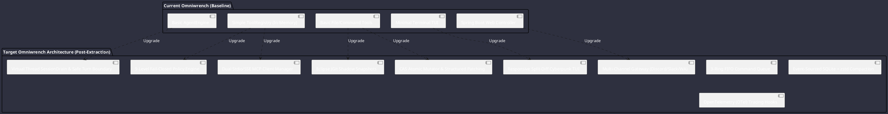

# Omniwrench Strategic Implementation Blueprint & Engineering Roadmap

**Session Goal**: Actionable architectural gap analysis, module-by-module design specification, and phased engineering roadmap for implementing advanced capabilities from **Google Antigravity SDK**, **OpenClaw**, and **OpenCode** into **Omniwrench** (Java 21 / Spring Boot 3.2+).

---

## 1. Architectural Gap Analysis

| Functional Capability | Current State | Extracted State-of-the-Art | Implementation Target Module |
| :--- | :--- | :--- | :--- |
| **Turn Execution Loop** | Single-threaded prompt eval | **Safe Provider-Turn Boundary & Context Epoch** | `omniwrench-core` |
| **Queue Management** | Unbounded thread pool | **3-Ring FIFO Priority Lanes (Foreground/Normal/BG)** | `omniwrench-core` |
| **Security & Policies** | Basic if/else checks | **9-Level Fail-Closed Priority Resolution Matrix** | `omniwrench-core` |
| **Session Persistence** | Ephemeral in-memory | **Relational SQLite Event Sourcing + zstd Archive** | `omniwrench-core` |
| **State Snapshots** | N/A | **Content-Addressed Shadow Git Trees (JGit)** | `omniwrench-tools` |
| **File Modifications** | Full file overwrite | **CAS Byte Verification + Structured Patching** | `omniwrench-tools` |
| **Tool Extensibility** | Hardcoded Java classes | **Pluggable Reflection SPI + Stdio/SSE MCP** | `omniwrench-tools` |
| **Tool Output Safety** | Unbounded string returns | **Managed Disk Spill Files (>50KB) + Preview** | `omniwrench-tools` |
| **Multi-Provider AI** | Single backend adapter | **Model Router + Ephemeral Prompt Caching** | `omniwrench-ai` |
| **Streaming UI** | Basic console prints | **Double-Buffered Lanterna + Responsive Split Diff** | `omniwrench-tui` |
| **Multi-Channel Chat** | Single REST endpoint | **Channel Plugins (Discord/Slack/Telegram/WA)** | `omniwrench-web` |
| **Human-in-the-Loop** | Simple console input | **Interactive QuestionManager with Action Buttons** | `omniwrench-web` |

---

## 2. Module-by-Module Design Specifications

### 2.1 `omniwrench-core` (Core Runtime & State Engine)
- **`com.omniwrench.core.drain.SessionDrainService`**: Virtual thread execution loop implementing the Safe Provider-Turn Boundary.
- **`com.omniwrench.core.queue.CommandQueueManager`**: 3-ring FIFO priority lane supervisor.
- **`com.omniwrench.core.policy.PolicyEngine`**: 9-level priority matrix with static/dynamic predicates.
- **`com.omniwrench.core.persistence.EventSourcedTranscriptRepository`**: SQLite schema management (`session_nodes`, `session_windows`, `transcript_events`, `session_transcript_archives`).
- **`com.omniwrench.core.hooks.HookRunner`**: Hierarchical context interceptor chain (`SessionContext` $\rightarrow$ `TurnContext` $\rightarrow$ `OperationContext`).

### 2.2 `omniwrench-ai` (Model Router & Prompt Intelligence)
- **`com.omniwrench.ai.router.ModelRouter`**: Multi-provider protocol router (Gemini 2.5, Claude 3.7 Sonnet, OpenAI o3-mini, Ollama, DeepSeek-R1).
- **`com.omniwrench.ai.cache.PromptCachePolicyInterceptor`**: Automatic injection of ephemeral prompt cache breakpoints at tools, system instructions, and user message turns.
- **`com.omniwrench.ai.stream.StreamDemuxer`**: Real-time demultiplexing of reasoning thought blocks, candidate text deltas, and tool invocations.

### 2.3 `omniwrench-tools` (Tooling, MCP, Git & Filesystem)
- **`com.omniwrench.tools.registry.ToolRegistry`**: MethodHandle reflection registry with invisible `@Injected ToolExecutionContext` filtering.
- **`com.omniwrench.tools.mcp.McpClientManager`**: Dual transport supervisor supporting Stdio subprocesses and Spring WebFlux SSE endpoints.
- **`com.omniwrench.tools.git.ShadowGitSnapshotService`**: Eclipse JGit bare shadow repository manager capturing content-addressed tree objects per turn for instant rollback.
- **`com.omniwrench.tools.fs.AtomicFileMutator`**: Compare-And-Swap (CAS) file writer and structured patch parser.
- **`com.omniwrench.tools.spill.ToolOutputSpillStore`**: Disk-backed output bounding for large tool results.

### 2.4 `omniwrench-tui` (Cyberpunk Terminal Interface)
- **`com.omniwrench.tui.screen.CyberpunkTerminalRenderer`**: Lanterna 3 double-buffered terminal UI with neon color palettes.
- **`com.omniwrench.tui.diff.ResponsiveSplitDiffViewer`**: Viewport-aware diff renderer (Side-by-side if columns > 120, stacked if <= 120).
- **`com.omniwrench.tui.palette.CommandPaletteDialog`**: Modal fuzzy search dispatcher for quick action navigation.

### 2.5 `omniwrench-web` (Multi-Channel Gateway & Streaming API)
- **`com.omniwrench.web.gateway.GatewayWebSocketHandler`**: Full-duplex JSON-RPC frame server (`GatewayFrame.Request`, `Response`, `Event`).
- **`com.omniwrench.web.questions.QuestionManager`**: Interactive human-in-the-loop approval manager.
- **`com.omniwrench.web.channels.ChannelPluginManager`**: Spring SPI registry for chat network adapters (Discord JDA, Slack Bolt, Telegram Bots, WhatsApp Baileys).

---

## 3. Phased Implementation Roadmap

### Phase 1: Core Engine & Safe Turn Boundary (Q1 2026)
1. Implement `SessionDrainService` with Virtual Threads (Java 21 Project Loom).
2. Establish the Safe Provider-Turn Boundary synchronization barrier.
3. Build the 9-level fail-closed `PolicyEngine`.
4. Deploy the 3-ring FIFO `CommandQueueManager`.

### Phase 2: Tooling, MCP & Shadow Git Snapshots (Q2 2026)
1. Integrate Eclipse JGit for content-addressed `ShadowGitSnapshotService`.
2. Build `AtomicFileMutator` with CAS byte validation and structured patching.
3. Deploy the Stdio and SSE `McpClientManager`.
4. Implement `ToolOutputSpillStore` for bounded tool executions.

### Phase 3: Cyberpunk TUI & OpenTelemetry Observability (Q3 2026)
1. Upgrade `omniwrench-tui` to double-buffered Lanterna 3 with responsive split diffs.
2. Implement the modal `CommandPaletteDialog` with fuzzy matching.
3. Wire OpenTelemetry (OTel) span interceptors into `HookRunner`.

### Phase 4: Multi-Channel Gateway & Interactive Approvals (Q4 2026)
1. Deploy `GatewayWebSocketHandler` with typed `GatewayFrame` framing.
2. Implement `QuestionManager` for human-in-the-loop approvals.
3. Ship channel adapters for Discord, Slack, Telegram, and WhatsApp.

### Phase 5: Relational Persistence & Rolling Compaction (2027+)
1. Implement SQLite relational event sourcing (`session_nodes`, `session_windows`, `transcript_events`).
2. Build rolling context compaction with zstd cold-tier archiving.
3. Implement SQLite FTS5 full-text search and local vector semantic recall.
