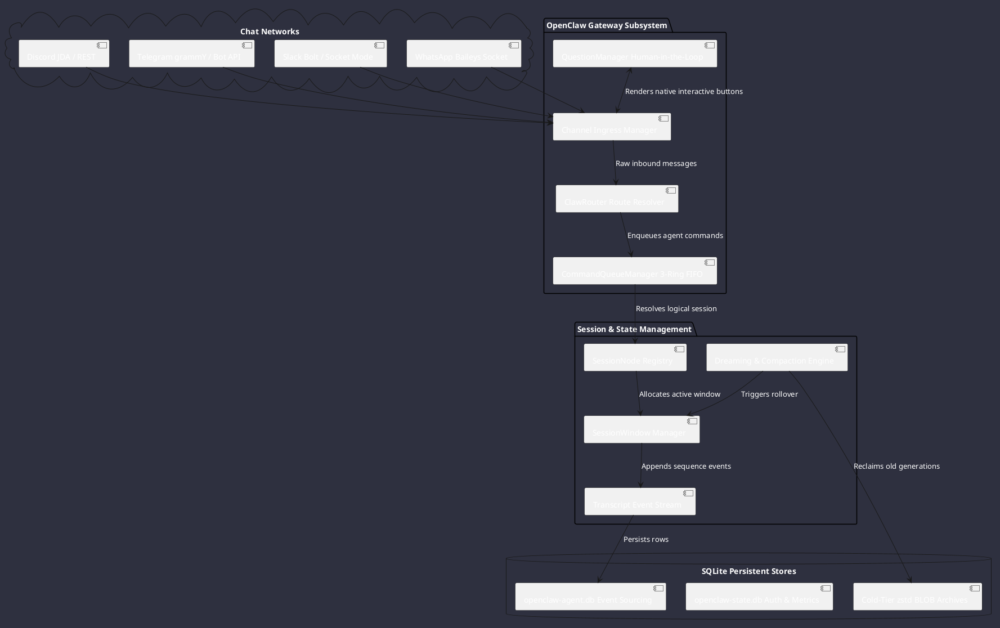
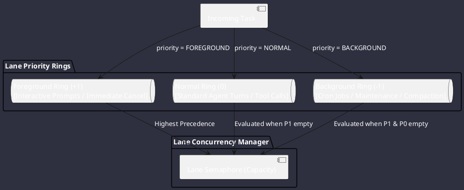
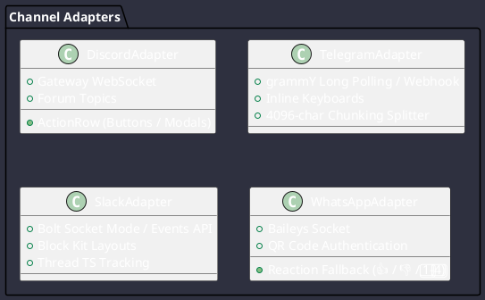
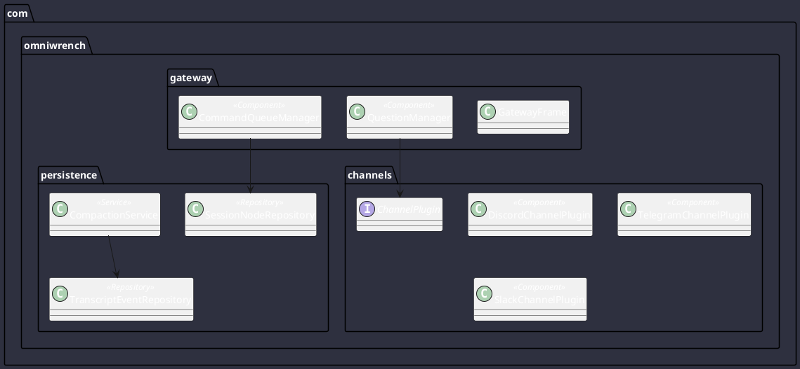

# Deep Architectural Analysis: OpenClaw Platform (`tmp/openclaw-main`)

**Codebase**: OpenClaw Multi-Channel Agent Gateway (`openclaw-main`)  
**Target Platform**: Omniwrench Java 21 / Spring Boot 3.2+ Architecture  
**Scope**: Gateway architecture, route resolution, FIFO command lanes, multi-channel chat integrations, interactive question gateway, relational event sourcing in SQLite, compaction replay, security guardrails, and concrete Java blueprints.

---

## 1. High-Level Architecture & Multi-Session Gateway Topology

OpenClaw is an enterprise multi-session gateway that connects external chat networks (Discord, Telegram, Slack, WhatsApp) to autonomous AI agents through a resilient, event-sourced architecture:



---

## 2. 3-Tier Session Hierarchy & Routing Architecture

### 2.1 Decoupled Session Layers

OpenClaw formalizes session state into three distinct layers:
1. **Logical Session (`session_nodes`)**: Represents the persistent identity of a conversation across restarts.
2. **Physical Transcript Window (`session_windows`)**: A generational epoch. When compaction occurs, a new window is created linked to the previous generation via `previous_session_id`.
3. **Channel-Neutral Conversation (`conversations`)**: Maps external channel delivery contexts (guild, thread, peer) to internal session keys.

### 2.2 Session Key Grammar (`src/routing/session-key.ts`)

| Session Scope | Key Structure Pattern | Example |
| :--- | :--- | :--- |
| **Agent Main** | `agent:<agentId>:main` | `agent:architect:main` |
| **Direct Peer** | `agent:<agentId>:<channel>:direct:<peerId>` | `agent:main:discord:direct:987654321` |
| **Account Direct** | `agent:<agentId>:<channel>:<accountId>:direct:<peerId>` | `agent:support:slack:T01AB:direct:U02CD` |
| **Group / Room** | `agent:<agentId>:<channel>:group:<peerId>` | `agent:main:telegram:group:-10012345` |
| **Channel / Topic**| `agent:<agentId>:<channel>:channel:<peerId>` | `agent:main:discord:channel:11223344` |
| **Thread** | `agent:<agentId>:<channel>:thread:<peerId>` | `agent:main:slack:thread:1700000000.123` |

### 2.3 Route Resolution (`ClawRouter`)

The `ResolveAgentRoute` engine resolves inbound channel messages using strict precedence:
1. `binding.peer`: Exact match on peer ID.
2. `binding.peer.parent`: Parent thread / forum container match.
3. `binding.peer.wildcard`: Regex or glob pattern match.
4. `binding.guild+roles`: Server ID combined with member role IDs (e.g. Discord admin role).
5. `binding.guild` / `binding.team`: Workspace / guild level binding.
6. `binding.account`: Channel account-specific binding.
7. `binding.channel`: Default channel fallback.
8. `default`: Global roster fallback agent.

---

## 3. Command Lanes & 3-Ring FIFO Priority Steering

To prevent heavy background batch tasks from starving interactive user prompts, OpenClaw implements **Named Command Lanes** backed by **3 FIFO priority rings**:



### Lane Definitions:
- **Static Lanes**: `Main` (concurrency 1), `SystemAgent` (concurrency 1), `Cron` (concurrency 2), `HookDispatch` (concurrency 2), `Subagent` (concurrency 4).
- **Dynamic Lanes**: `session:<sessionKey>` (guarantees serialized turn execution per session).
- **Capacity Groups**: `cron-hooks` reserves dedicated capacity for hook dispatches so background cron tasks cannot block webhooks.

---

## 4. Multi-Channel Integration Architecture

### 4.1 Channel Plugin Contract (`ChannelPlugin`)

Every channel integration implements a unified lifecycle and delivery SPI:

| Interface Surface | Functional Scope | Key Methods |
| :--- | :--- | :--- |
| **`config`** | Account resolution and credential validation | `listAccountIds`, `resolveAccount`, `isEnabled` |
| **`gateway`** | Connection initialization & lifecycle | `startAccount(ctx)`, `stopAccount(ctx)` |
| **`outbound`** | Message delivery, attachments, & retry | `deliver`, `sendText`, `sendMedia`, `sendPoll` |
| **`messaging`** | Inbound parsing & reply routing | `resolveInboundConversation`, `transformReplyPayload` |
| **`actions`** | Channel-native interactive capabilities | `addReaction`, `editMessage`, `deleteMessage` |
| **`streaming`** | Real-time response streaming | `draft-stream` chunking, live edit typing |
| **`approval`** | Human-in-the-loop interactive buttons | `renderApprovalPrompt`, `handleInteraction` |

### 4.2 Channel Adapter Details



---

## 5. Interactive Question Gateway (`QuestionManager`)

When an agent needs human input or approval, the `QuestionManager` coordinates the interaction:

```plantuml
@startuml
skinparam backgroundColor #2e303f
skinparam defaultFontColor #ffffff

actor User
participant "Channel Adapter
(Discord/Slack)" as Channel
participant "QuestionManager" as QM
participant "Agent Engine" as Agent

Agent -> QM: requestQuestion(prompt, options, timeout=60s)
QM --> Agent: QuestionRecord(id="ask_abcd1234", status=PENDING)
QM -> Channel: renderInteractiveButtons(id, prompt, options)
Channel -> User: Displays message with action buttons

User -> Channel: Clicks Button [Option 2]
Channel -> QM: answerQuestion(id="ask_abcd1234", optionIndex=1)
QM -> Agent: Completes pending Future with selected index
Agent -> Agent: Resumes reasoning with user decision
@enduml
```

- **Fallback Strategy**: On platforms without native button support (e.g. WhatsApp, simple SMS), the gateway automatically falls back to rendering numbered lists with emoji reaction listeners (1️⃣, 2️⃣, 3️⃣).

---

## 6. Event-Sourced SQLite Schema & Compaction Replay

OpenClaw persists conversational history using strict relational event sourcing:

```sql
-- 1. Logical Session Master Table
CREATE TABLE session_nodes (
  session_key TEXT NOT NULL PRIMARY KEY,
  current_session_id TEXT NOT NULL,
  entry_json TEXT NOT NULL,
  status TEXT CHECK (status IN (running, done, failed, killed, timeout)),
  parent_session_key TEXT,
  spawned_by TEXT,
  pinned_at INTEGER,
  archived_at INTEGER,
  updated_at INTEGER NOT NULL
) STRICT;

-- 2. Physical Transcript Windows (Compaction Generations)
CREATE TABLE session_windows (
  session_id TEXT NOT NULL PRIMARY KEY,
  session_key TEXT NOT NULL,
  previous_session_id TEXT,
  reason TEXT CHECK (reason IN (initial, reset, rollover, fork, rewind, switch, recovery, compaction)),
  transcript_updated_at INTEGER,
  created_at INTEGER NOT NULL,
  FOREIGN KEY (session_key) REFERENCES session_nodes(session_key) ON DELETE CASCADE
) STRICT;

-- 3. Sequential Transcript Events
CREATE TABLE transcript_events (
  session_id TEXT NOT NULL,
  seq INTEGER NOT NULL,
  event_json TEXT NOT NULL,
  created_at INTEGER NOT NULL,
  PRIMARY KEY (session_id, seq),
  FOREIGN KEY (session_id) REFERENCES session_windows(session_id) ON DELETE CASCADE
) STRICT;

-- 4. Active Branch Index & Pagination
CREATE TABLE session_transcript_active_events (
  session_id TEXT NOT NULL,
  active_position INTEGER NOT NULL,
  event_seq INTEGER NOT NULL,
  message_position INTEGER,
  PRIMARY KEY (session_id, active_position),
  FOREIGN KEY (session_id, event_seq) REFERENCES transcript_events(session_id, seq) ON DELETE CASCADE
) STRICT;

-- 5. Cold-Tier Reclaimed Transcript Archive
CREATE TABLE session_transcript_archives (
  session_id TEXT NOT NULL,
  generation TEXT NOT NULL,
  session_key TEXT NOT NULL,
  encoding TEXT NOT NULL CHECK (encoding IN (identity, zstd)),
  archive_blob BLOB NOT NULL,
  archive_sha256 TEXT NOT NULL,
  PRIMARY KEY (session_id, generation)
) STRICT;

-- 6. Full-Text Search Virtual Table
CREATE VIRTUAL TABLE session_transcript_fts USING fts5(
  text, session_id UNINDEXED, message_id UNINDEXED, role UNINDEXED, timestamp UNINDEXED
);
```

### Compaction & Dreaming Workflow:
1. **Preflight Check**: Evaluates token consumption against model limits.
2. **Context Distillation**: Invokes a compaction model to distill historical facts and decisions into a condensed summary block.
3. **Generation Transition**: Creates a new `session_windows` row with `reason=compaction` and links `previous_session_id`.
4. **Archive & Compression**: Old raw events are compressed into `session_transcript_archives` via zstd, freeing operational memory while maintaining full auditable history.

---

## 7. Java 21 / Spring Boot 3 Implementation Blueprint for Omniwrench

### 7.1 Component Blueprint



### 7.2 Concrete Java Implementation Code

#### 1. Command Queue Manager with Virtual Threads & Priority Rings
```java
package com.omniwrench.gateway.queue;

import org.springframework.stereotype.Component;

import java.util.concurrent.*;
import java.util.concurrent.atomic.AtomicLong;

@Component
public class CommandQueueManager {

    public enum Priority {
        FOREGROUND(1),
        NORMAL(0),
        BACKGROUND(-1);

        private final int level;
        Priority(int level) { this.level = level; }
        public int getLevel() { return level; }
    }

    public record QueueItem<T>(
            long sequence,
            Priority priority,
            Callable<T> task,
            CompletableFuture<T> future
    ) implements Comparable<QueueItem<?>> {
        @Override
        public int compareTo(QueueItem<?> o) {
            int p = Integer.compare(o.priority.getLevel(), this.priority.getLevel());
            if (p != 0) return p;
            return Long.compare(this.sequence, o.sequence); // FIFO for equal priority
        }
    }

    private final ConcurrentHashMap<String, PriorityBlockingQueue<QueueItem<?>>> queues = new ConcurrentHashMap<>();
    private final ConcurrentHashMap<String, Semaphore> semaphores = new ConcurrentHashMap<>();
    private final AtomicLong sequenceGenerator = new AtomicLong(1);
    private final ExecutorService executor = Executors.newVirtualThreadPerTaskExecutor();

    public <T> CompletableFuture<T> submit(String lane, Priority priority, Callable<T> task) {
        PriorityBlockingQueue<QueueItem<?>> queue = queues.computeIfAbsent(lane, k -> new PriorityBlockingQueue<>());
        Semaphore semaphore = semaphores.computeIfAbsent(lane, k -> new Semaphore(resolveLaneConcurrency(lane)));

        CompletableFuture<T> future = new CompletableFuture<>();
        QueueItem<T> item = new QueueItem<>(sequenceGenerator.getAndIncrement(), priority, task, future);
        queue.add(item);

        drainLane(lane);
        return future;
    }

    private void drainLane(String lane) {
        executor.submit(() -> {
            PriorityBlockingQueue<QueueItem<?>> queue = queues.get(lane);
            Semaphore semaphore = semaphores.get(lane);
            if (queue == null || semaphore == null) return;

            while (!queue.isEmpty() && semaphore.tryAcquire()) {
                QueueItem<?> item = queue.poll();
                if (item == null) {
                    semaphore.release();
                    break;
                }

                executor.submit(() -> {
                    try {
                        Object res = item.task().call();
                        ((CompletableFuture<Object>) item.future()).complete(res);
                    } catch (Throwable t) {
                        item.future().completeExceptionally(t);
                    } finally {
                        semaphore.release();
                        drainLane(lane);
                    }
                });
            }
        });
    }

    private int resolveLaneConcurrency(String lane) {
        return switch (lane) {
            case "main" -> 1;
            case "cron" -> 2;
            case "subagent" -> 4;
            default -> 1; // Serialized per session lane
        };
    }
}
```

#### 2. Channel Plugin SPI
```java
package com.omniwrench.channels;

import java.util.List;
import java.util.concurrent.CompletableFuture;

public interface ChannelPlugin {

    String getChannelId();

    CompletableFuture<Void> start();
    CompletableFuture<Void> stop();

    CompletableFuture<DeliveryResult> sendMessage(OutboundMessage message);

    record OutboundMessage(
            String recipientId,
            String text,
            String replyToMessageId,
            String threadId,
            List<Attachment> attachments
    ) {}

    record Attachment(String contentType, byte[] data, String filename) {}
    record DeliveryResult(boolean success, String messageId, String error) {}
}
```

---

## 8. Key Architectural Takeaways for Omniwrench
1. **Decouple Sessions into 3 Layers**: Separate logical sessions from physical transcript windows to enable seamless compaction and rollover.
2. **Prioritized Command Lanes**: Use 3-ring FIFO priority queues to protect interactive user prompts from long-running background tasks.
3. **Pluggable Multi-Channel SPI**: Standardize channel adapters (Discord, Slack, Telegram, WhatsApp) behind a single `ChannelPlugin` interface.
4. **Relational Event Sourcing**: Use SQLite with strict schemas, active position indexing, and zstd cold-tier archiving.
