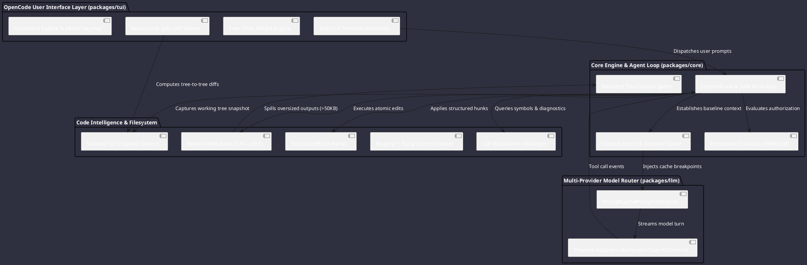
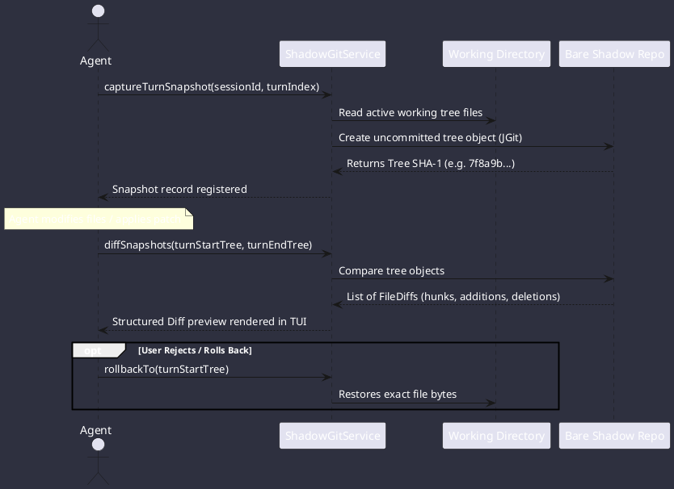

# Deep Architectural Analysis: OpenCode Engine (`tmp/opencode-dev`)

**Codebase**: OpenCode Agentic Coding Platform (`opencode-dev`)  
**Target Platform**: Omniwrench Java 21 / Spring Boot 3.2+ Architecture  
**Scope**: TUI engine, Tree-Sitter syntax highlighting, dual-pane diffs, LSP code intelligence, structured patching, Compare-And-Swap (CAS) file mutations, shadow Git snapshots, prompt caching injection, bounded tool output spill files, and concrete Java blueprints.

---

## 1. High-Level Architecture & Core Principles

OpenCode is an enterprise-grade agentic coding engine architected around **deterministic turn execution**, **local-first AST code intelligence**, and **zero-risk filesystem state snapshots**:



---

## 2. Terminal User Interface (TUI) Architecture

### 2.1 Reactive JSX Terminal Reconciler
`packages/tui` leverages a reactive Solid-based reconciler targeting standard VT100 / ANSI escape sequences:
- **Terminal Primitives**: `<box>`, `<scrollbox>`, `<text>`, `<code>`, `<diff>`, `<line_number>`.
- **Responsive Layout Engine**:
  - `width > 120`: Side-by-side split diff layout with persistent 42-column sidebar for session metadata and tool trees.
  - `width <= 120`: Unified stacked diff layout with modal overlay sidebar.

### 2.2 AST-Accurate Syntax Highlighting via Tree-Sitter
- Employs embedded WebAssembly Tree-Sitter grammars for major languages (Java, TypeScript, Rust, Go, Python, C++, etc.).
- Compiles Neovim SCM highlight queries (`highlights.scm`, `locals.scm`) at runtime to deliver AST-tokenized highlighting in terminal cells.

---

## 3. Code Intelligence & Language Server Protocol (LSP)

### 3.1 Multi-Server Lifecycle Manager (`packages/opencode/src/lsp`)
- **Auto-Discovery**: Scans directories upward for project markers (`pom.xml`, `package.json`, `go.mod`, `Cargo.toml`, `.git`).
- **Standardized stdio JSON-RPC**: Spawns and supervises language servers (Eclipse JDTLS, Pyright, Rust-Analyzer, Gopls, typescript-language-server).
- **Push & Pull Diagnostics**:
  - Handles `textDocument/publishDiagnostics` with 150ms debouncing and deduplication.
  - Exposes `getDiagnostics()`, `findDefinition()`, `findReferences()`, and `findWorkspaceSymbols()`.

### 3.2 High-Speed Search Engine
- Background crawling via Ripgrep (`ripgrep.find`).
- Ultra-fast fuzzy ranking using `fuzzysort` and native Rust matching.

---

## 4. Structured Patching & Compare-And-Swap (CAS) File Mutations

### 4.1 Structured Patch Format (`packages/core/src/patch.ts`)
Rather than rewriting full files (which wastes tokens and causes hallucinated deletions), OpenCode enforces a structured patch protocol:

```text
*** Begin Patch
*** Update File: src/main/java/com/example/Service.java
@@ public void process()
 public void process() {
-    oldLogic();
+    newRobustLogic();
 }
*** Add File: src/main/java/com/example/NewComponent.java
+package com.example;
+public class NewComponent {}
*** End Patch
```

- **Whitespace Tolerant & Context Seeking**: Scans around target lines to find matching context even if line numbers shift.

### 4.2 Atomic Compare-And-Swap (CAS) Mutator
`packages/core/src/file-mutation.ts` guards against race conditions:
1. **`KeyedMutex`**: File-path-scoped reentrant lock.
2. **`writeIfUnchanged`**: Compares exact SHA-256 byte hashes before applying edits; throws `StaleContentException` if the file changed externally during model generation.

---

## 5. Shadow Git Snapshots for Zero-Risk State Recovery

OpenCode captures isolated Git snapshots under `~/.local/share/opencode/snapshot/<project-id>/<hash>`:



### Advantages:
- **Zero Impact on Git Working Status**: Operates on bare shadow repositories; never creates fake commits or modifies the user’s active `.git` branch history.
- **Instant Multi-Turn Undo/Redo**: Operators can jump backward and forward across the turn timeline with complete filesystem restoration.

---

## 6. Prompt Caching Strategy & Bounded Output Spills

### 6.1 Ephemeral Prompt Cache Breakpoints
`packages/llm/src/cache-policy.ts` automatically attaches prompt caching markers at 3 strategic positions:
1. **Last Tool Definition**: Caches all system tools and custom function schemas.
2. **Last Static System Prompt Part**: Caches project rules (`AGENTS.md`, guidelines).
3. **Latest User Message**: Caches historical conversational turns up to the active prompt.

> **Impact**: Cuts turn latency by 60–80% and reduces API billing costs by up to 90% during iterative tool execution loops on Anthropic, Gemini, and DeepSeek.

### 6.2 Managed Tool Output Spill Files
To prevent models from blowing their context windows when running commands like `git log` or `find`:
- Hard limits: `MAX_LINES = 2,000`, `MAX_BYTES = 50 KB`.
- If exceeded, OpenCode writes the full un-truncated output to disk (`~/.local/share/opencode/tool-output/tool_<id>`).
- Returns a structured head + tail preview to the model with the exact file path so the model can inspect specific sections via `read_file`.

---

## 7. Java 21 / Spring Boot 3 Implementation Blueprint for Omniwrench

### 7.1 Component Architecture

```plantuml
@startuml
skinparam backgroundColor #2e303f
skinparam defaultFontColor #ffffff

package "com.omniwrench.fs" {
  class AtomicFileMutator <<Service>>
  class StructuredPatchParser <<Component>>
}

package "com.omniwrench.git" {
  class ShadowGitSnapshotService <<Service>>
  record FileDiff
}

package "com.omniwrench.lsp" {
  class LSPClientManager <<Service>>
  interface LanguageServerHost
}

package "com.omniwrench.ai.cache" {
  class PromptCachePolicyInterceptor <<Component>>
}

package "com.omniwrench.tools.spill" {
  class ToolOutputSpillStore <<Component>>
}

AtomicFileMutator --> StructuredPatchParser
AtomicFileMutator --> ToolOutputSpillStore
ShadowGitSnapshotService --> FileDiff
@enduml
```

### 7.2 Concrete Java Implementation Code

#### 1. Shadow Git Snapshot Service (using Eclipse JGit)
```java
package com.omniwrench.git;

import org.eclipse.jgit.api.Git;
import org.eclipse.jgit.dircache.DirCache;
import org.eclipse.jgit.dircache.DirCacheBuilder;
import org.eclipse.jgit.dircache.DirCacheEntry;
import org.eclipse.jgit.lib.*;
import org.eclipse.jgit.treewalk.TreeWalk;
import org.springframework.stereotype.Service;

import java.io.File;
import java.io.IOException;
import java.nio.file.Files;
import java.nio.file.Path;
import java.util.Map;
import java.util.concurrent.ConcurrentHashMap;

@Service
public class ShadowGitSnapshotService {

    private final Map<Path, Repository> shadowRepos = new ConcurrentHashMap<>();

    public ObjectId captureSnapshot(Path projectRoot) throws IOException {
        Repository repo = getOrCreateShadowRepo(projectRoot);
        ObjectInserter inserter = repo.newObjectInserter();

        DirCache dirCache = DirCache.newInCore();
        DirCacheBuilder builder = dirCache.builder();

        try (var stream = Files.walk(projectRoot)) {
            stream.filter(Files::isRegularFile)
                  .filter(p -> !p.toString().contains("/.git/") && !p.toString().contains("/target/"))
                  .forEach(filePath -> {
                      try {
                          byte[] bytes = Files.readAllBytes(filePath);
                          ObjectId blobId = inserter.insert(Constants.OBJ_BLOB, bytes);
                          
                          String relativePath = projectRoot.relativize(filePath).toString().replace("\\", "/");
                          DirCacheEntry entry = new DirCacheEntry(relativePath);
                          entry.setFileMode(FileMode.REGULAR_FILE);
                          entry.setObjectId(blobId);
                          entry.setLength(bytes.length);
                          entry.setLastModified(Files.getLastModifiedTime(filePath).toMillis());
                          builder.add(entry);
                      } catch (IOException e) {
                          throw new RuntimeException(e);
                      }
                  });
        }

        builder.finish();
        ObjectId treeId = dirCache.writeTree(inserter);
        inserter.flush();
        return treeId;
    }

    private Repository getOrCreateShadowRepo(Path projectRoot) throws IOException {
        return shadowRepos.computeIfAbsent(projectRoot, p -> {
            try {
                Path shadowDir = Path.of(System.getProperty("user.home"), ".omniwrench", "snapshots", Integer.toHexString(p.hashCode()));
                Files.createDirectories(shadowDir);
                return Git.init().setDirectory(shadowDir.toFile()).setBare(true).call().getRepository();
            } catch (Exception e) {
                throw new RuntimeException("Failed to init shadow repo", e);
            }
        });
    }
}
```

#### 2. Bounded Tool Output Spill Store
```java
package com.omniwrench.tools.spill;

import org.springframework.stereotype.Component;

import java.io.IOException;
import java.nio.charset.StandardCharsets;
import java.nio.file.Files;
import java.nio.file.Path;
import java.util.concurrent.atomic.AtomicLong;

@Component
public class ToolOutputSpillStore {

    private static final int MAX_BYTES = 50 * 1024; // 50 KB
    private static final int MAX_LINES = 2000;
    private final Path storageDirectory;
    private final AtomicLong fileCounter = new AtomicLong(1);

    public ToolOutputSpillStore() throws IOException {
        this.storageDirectory = Path.of(System.getProperty("user.home"), ".omniwrench", "tool-outputs");
        Files.createDirectories(storageDirectory);
    }

    public record BoundedOutput(String previewText, boolean spilled, Path spillPath, long totalBytes, int totalLines) {}

    public BoundedOutput boundOutput(String rawOutput) throws IOException {
        byte[] bytes = rawOutput.getBytes(StandardCharsets.UTF_8);
        String[] lines = rawOutput.split("\\R");

        if (bytes.length <= MAX_BYTES && lines.length <= MAX_LINES) {
            return new BoundedOutput(rawOutput, false, null, bytes.length, lines.length);
        }

        // Spill full content to disk
        String filename = String.format("tool_output_%08d.txt", fileCounter.getAndIncrement());
        Path spillFile = storageDirectory.resolve(filename);
        Files.write(spillFile, bytes);

        // Generate truncated head + tail preview
        StringBuilder preview = new StringBuilder();
        preview.append(String.format("[Output truncated: %d bytes, %d lines. Full output spilled to: %s]\n\n", bytes.length, lines.length, spillFile));
        
        int headCount = Math.min(lines.length, 50);
        for (int i = 0; i < headCount; i++) {
            preview.append(lines[i]).append("\n");
        }
        preview.append("\n... [TRUNCATED] ...\n\n");
        int tailCount = Math.min(lines.length - headCount, 50);
        for (int i = lines.length - tailCount; i < lines.length; i++) {
            preview.append(lines[i]).append("\n");
        }

        return new BoundedOutput(preview.toString(), true, spillFile, bytes.length, lines.length);
    }
}
```

---

## 8. Key Architectural Takeaways for Omniwrench
1. **Shadow Git Snapshots via JGit**: Capture content-addressed working tree snapshots before/after each turn to enable instant diff previews and zero-risk rollbacks.
2. **Structured Patching**: Adopt the `*** Begin Patch` format to reduce token usage and prevent accidental code deletions.
3. **Compare-And-Swap File Mutations**: Guard all file writes with byte-hash checks to prevent race conditions.
4. **Prompt Cache Breakpoints**: Inject cache markers into model requests to slash latency and API costs.
5. **Tool Output Spill Files**: Protect context windows from large tool outputs by spilling to disk with structured head/tail summaries.
