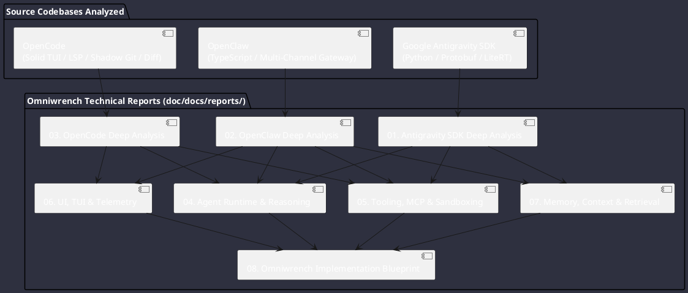

# Omniwrench Comparative Architectural Analysis & Technology Extraction Report

**Session Goal**: Comprehensive high-level and detailed architectural analysis of projects located in `tmp/` (**Google Antigravity SDK Python**, **OpenClaw**, and **OpenCode**), extracting features, functions, APIs, design patterns, and engineering concepts, formulated into actionable implementation blueprints for **Omniwrench** (Java 21 / Spring Boot 3.2+).

---

## 🧭 Master Reports Index

The analysis is partitioned into eight specialized technical reports and an overarching implementation blueprint:

### Specialized Technical Reports

1. [Google Antigravity SDK Deep Analysis](antigravity_sdk_analysis.md)
   - 3-tier layering model (`Agent` $\\rightarrow$ `Conversation` $\\rightarrow$ `ConnectionStrategy`).
   - Length-prefixed binary stdio IPC & WebSocket JSON/Protobuf protocol.
   - Multiplexed lazy cursor streaming with shared buffers (`ChatResponse`).
   - 9-level deterministic policy evaluation matrix (fail-closed security).
   - Hierarchical hook scoping (`SessionContext` $\\rightarrow$ `TurnContext` $\\rightarrow$ `OperationContext`).
   - Virtual thread reactive triggers (cron, interval, file watchers).
   - In-process `ToolRunner` with invisible `ToolContext` parameter injection.

2. [OpenClaw Deep Analysis](openclaw_analysis.md)
   - 3-tier session hierarchy (`session_nodes` $\\rightarrow$ `session_windows` $\\rightarrow$ `conversations`).
   - `ClawRouter` model routing & dynamic tool compatibility families.
   - Command lanes & 3-ring FIFO priority steering (Foreground, Normal, Background).
   - Standardized `GatewayFrame` envelope over WebSockets (`req`, `res`, `event`).
   - Channel plugin SPI (`Discord`, `Telegram`, `Slack`, `WhatsApp`, `Matrix`).
   - Interactive `QuestionManager` for human-in-the-loop approvals.
   - Relational event-sourced SQLite schema with rolling compaction and cold-tier zstd archives.

3. [OpenCode Deep Analysis](opencode_analysis.md)
   - Solid / Terminal reactive UI with split-pane / dual-screen layouts and Tree-Sitter AST syntax highlighting.
   - Language Server Protocol (`LSP4J`) client lifecycle manager, diagnostic cache, and code intelligence.
   - Structured patch protocol (`*** Begin Patch ... *** End Patch`) and Compare-And-Swap (CAS) file mutations.
   - Content-addressed shadow Git snapshots (`JGit`) capturing working trees for instant zero-risk rollback/undo.
   - Prompt caching policy injector placing ephemeral breakpoints to cut latency and token costs.
   - Managed flat spill files for bounded tool outputs preventing context window blowouts.

4. [Comparative Agent Runtime & Reasoning Report](agent_runtime_and_reasoning_report.md)
   - State machine models across all three engines.
   - Safe Provider-Turn Boundaries and Context Epoch mechanics.
   - Streaming reasoning loop, event-driven step dispatch, and cancellation lifecycles.
   - Inter-agent collaboration protocols (cloning, dynamic spawning, depth ceilings).

5. [Tooling, MCP & Sandboxing Report](tooling_mcp_and_sandboxing_report.md)
   - Tool registration via Java reflection & OpenAPI 3.0 schema generation.
   - MCP (Model Context Protocol) client implementations (Stdio subprocess & HTTP SSE).
   - Tool execution sandboxing, filesystem path containment, and network SSRF prevention.
   - Host tool interceptor hooks (`pre_tool`, `post_tool`, `on_tool_error`).

6. [UI, TUI & Telemetry Architecture Report](ui_tui_and_telemetry_report.md)
   - Cyberpunk TUI design with Lanterna / JLine3 and ANSI escape engines.
   - Command palette fuzzy navigation and customizable keymap trees.
   - Split/unified diff viewer and AST syntax rendering.
   - Distributed tracing with OpenTelemetry (OTel) spans across sessions, turns, steps, and tool calls.

7. [Memory, Context & Retrieval Report](memory_context_and_retrieval_report.md)
   - Storage layouts: JSONL append-only transcripts vs. SQLite relational event sourcing.
   - Multi-stage context compaction, token budgeting preflights, and generation rollover.
   - SQLite FTS5 full-text indexing and local vector embeddings for semantic recall.

8. [Omniwrench Strategic Implementation Blueprint](omniwrench_implementation_roadmap.md)
   - Architectural gap analysis of Omniwrench.
   - Module-by-module feature mapping (`omniwrench-core`, `omniwrench-ai`, `omniwrench-tools`, `omniwrench-tui`, `omniwrench-web`).
   - Prioritized, phased 2026-2029 execution roadmap.

---

## 📊 Cross-Project Feature Comparison Matrix

| Architectural Feature | Google Antigravity SDK | OpenClaw | OpenCode | Omniwrench Target Architecture |
| :--- | :--- | :--- | :--- | :--- |
| **Primary Language** | Python 3.11+ / Go Backend | TypeScript / Node.js | TypeScript / Solid / Effect-TS | **Java 21 / Spring Boot 3.2+** |
| **Concurrency Model** | `asyncio` / Python GIL | Event Loop / Node Promises | Effect-TS Fibers | **Java 21 Virtual Threads (Loom)** |
| **Agent Layering** | 3-Tier (`Agent`/`Conv`/`Conn`) | 3-Tier (`Node`/`Window`/`Conv`) | Domain Core / Session Drain | **Spring Service & Context Hierarchy** |
| **Tool Protocol** | Custom JSON-RPC & MCP | MCP & Internal Tools | Custom Tools & MCP | **Spring SPI + Java Reflection + MCP** |
| **Context Injection** | Filtered Parameter Injection | Runtime Context Binding | System Context Provider | **`@Injected ToolExecutionContext`** |
| **Policy Engine** | 9-Level Priority Matrix | Role & Rule Bindings | Wildcard Action/Resource Rules | **Deterministic 9-Level Java Rules Engine** |
| **File Mutation** | Full File Writes | Full File Overwrites | Structured CAS Patching | **Atomic CAS + Structured Hunk Patching** |
| **Snapshot Engine** | N/A | SQLite Session State | Shadow Git (Bare Repo) | **Eclipse JGit Content-Addressed Trees** |
| **Channel Support** | Single CLI / IPC Client | Discord, Telegram, Slack, WA | Terminal CLI & Desktop App | **Multi-Channel Spring Gateway + TUI** |
| **LSP Intelligence** | External MCP | N/A | Embedded LSP Client Manager | **Eclipse LSP4J Multi-Server Host** |
| **TUI Interface** | Minimal CLI | Terminal Dashboard | Solid-based Reactive TUI | **Lanterna 3 + JLine 3 Cyberpunk TUI** |
| **Telemetry** | OpenTelemetry (OTel) Hooks | Diagnostic Event Log | Event Stream Protocol | **Spring Actuator + Micrometer + OTel** |
| **Memory & Storage** | JSONL Transcripts | SQLite Event Sourcing + FTS5 | SQLite + Flat Spill Files | **SQLite (jOOQ/JDBC) + Flat JSONL** |
