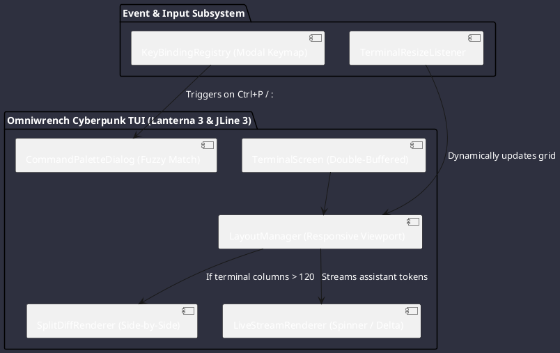
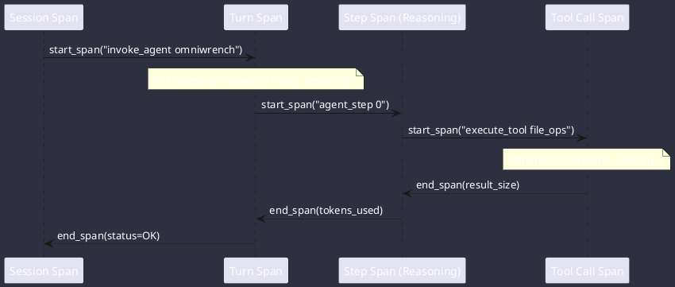

# Comparative Report: User Interfaces, Cyberpunk TUI & Telemetry Architecture

**Comparison Subjects**: Google Antigravity SDK, OpenClaw, OpenCode  
**Target Platform**: Omniwrench Java 21 / Spring Boot 3.2+ Architecture  
**Focus Area**: Cyberpunk terminal rendering, responsive split diffs, command palette, live streaming WebSockets, and OpenTelemetry (OTel) observability.

---

## 1. UI & Telemetry Architecture Comparison

| Feature Dimension | Google Antigravity SDK | OpenClaw | OpenCode | Omniwrench Target Architecture |
| :--- | :--- | :--- | :--- | :--- |
| **Terminal UX** | Minimal CLI Stream | Terminal Dashboard | Solid-based Reactive TUI | **Lanterna 3 + JLine 3 Cyberpunk TUI** |
| **Diff Viewer** | Plain text diffs | Text / Unified Diff | Responsive Side-by-Side / Unified | **Responsive Terminal Split-Diff** |
| **Command Palette** | Slash command parser | Slash command router | Fuzzy Modal Command Palette | **Fuzzy Command Palette Modal** |
| **Syntax Highlighting**| ANSI raw escapes | Chalk / Prism | Tree-Sitter WASM grammars | **JLine Syntax Highlighting + ANSI** |
| **Web Dashboard** | N/A | Control UI (Svelte / Vue) | Electron Desktop & Web | **Spring Boot Web + WebSocket UI** |
| **Tracing Protocol** | OpenTelemetry (OTel) Spans | Diagnostic Event Logs | Internal Event Bus | **Micrometer Tracing + OTel Spans** |

---

## 2. Cyberpunk Terminal User Interface (TUI) Architecture



### 2.1 Responsive Viewport Mechanics:
- **Columns > 120**: Renders side-by-side split diffs with persistent 40-column telemetry and subagent status sidebar.
- **Columns <= 120**: Switches dynamically to a unified stacked diff format with collapsible overlay drawers.

---

## 3. OpenTelemetry (OTel) Distributed Tracing Architecture

Extracted from Google Antigravity SDK (`utils/otel.py`), Omniwrench maps hierarchical execution traces directly into standard OTel spans:



### Standard Span Attributes:
- `gen_ai.operation.name`: `invoke_agent` / `chat_turn`
- `gen_ai.system`: `omniwrench`
- `gen_ai.request.model`: `gemini-2.5-pro` / `claude-3-7-sonnet`
- `gen_ai.usage.input_tokens`: `1450`
- `gen_ai.usage.output_tokens`: `320`
- `tool.name`: `run_command`
- `tool.status`: `success` | `error`

---

## 4. WebSocket Streaming Protocol (`GatewayFrame`)

Omniwrench exposes a high-throughput, low-latency WebSocket endpoint for browser dashboards and IDE extensions:

```json
{
  "type": "event",
  "event": "chat.delta",
  "payload": {
    "sessionId": "4a7c1b2e-...",
    "stepIndex": 12,
    "delta": "Analyzing repository topology...",
    "kind": "THOUGHT"
  },
  "seq": 104
}
```

---

## 5. Java 21 / Spring Boot 3 Implementation Blueprint for Omniwrench

### 5.1 Cyberpunk Terminal Screen Renderer
```java
package com.omniwrench.tui;

import com.googlecode.lanterna.TerminalSize;
import com.googlecode.lanterna.TextColor;
import com.googlecode.lanterna.graphics.TextGraphics;
import com.googlecode.lanterna.screen.Screen;
import com.googlecode.lanterna.screen.TerminalScreen;
import com.googlecode.lanterna.terminal.DefaultTerminalFactory;
import com.googlecode.lanterna.terminal.Terminal;
import org.springframework.stereotype.Component;

import java.io.IOException;

@Component
public class CyberpunkTerminalRenderer implements AutoCloseable {

    private final Screen screen;
    public static final TextColor CYAN_NEON = new TextColor.RGB(0, 255, 230);
    public static final TextColor PURPLE_NEON = new TextColor.RGB(180, 70, 255);
    public static final TextColor BG_DARK = new TextColor.RGB(20, 22, 34);

    public CyberpunkTerminalRenderer() throws IOException {
        Terminal terminal = new DefaultTerminalFactory().createTerminal();
        this.screen = new TerminalScreen(terminal);
        this.screen.startScreen();
        this.screen.setCursorPosition(null); // Hide cursor
    }

    public void renderHeader(String sessionTitle, String activeModel) throws IOException {
        TextGraphics tg = screen.newTextGraphics();
        TerminalSize size = screen.getTerminalSize();

        tg.setBackgroundColor(BG_DARK);
        tg.fill(' ');

        tg.setForegroundColor(CYAN_NEON);
        tg.putString(2, 0, "⚡ OMNIWRENCH // CYBERPUNK WORKBENCH 2026");

        tg.setForegroundColor(PURPLE_NEON);
        String modelTag = "[MODEL: " + activeModel + "]";
        tg.putString(size.getColumns() - modelTag.length() - 2, 0, modelTag);

        screen.refresh();
    }

    @Override
    public void close() throws IOException {
        screen.stopScreen();
    }
}
```

---

## 6. Summary Recommendations
1. **Double-Buffered Lanterna TUI** to eliminate terminal flicker during rapid LLM token streaming.
2. **Responsive Dual-Screen Diff View** that adjusts layout based on terminal width.
3. **Native OpenTelemetry Instrumentation** across all agent turns, steps, and tool invocations.
