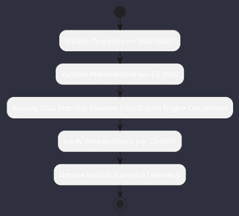

# REQ-00001: Dual Interface Runtime Initialization

## Requirement Metadata

| Property | Value |
|---|---|
| **Requirement ID** | `REQ-00001` |
| **Title** | Dual Interface Runtime Initialization |
| **Traceability** | [ADR-0001](../knowledge/knowledge_base.md) |
| **Priority** | Critical |
| **Verification Method** | Automated Integration Test |
| **Status** | Implemented |

## Description

Omniwrench shall initialize both a full Lanterna TUI and Spring Boot Web/WebSocket server concurrently within the same JVM process without thread deadlocks or port collisions.

## Rationale & Context

Enables local engineers to code via rich terminal TUI while remote observers or CI monitors view telemetry in web browser.

## Architecture Specification & Activity Flow

## Acceptance & Verification Criteria

1. **Functional Compliance**: The implementation satisfies all criteria defined in [ADR-0001](../knowledge/knowledge_base.md).
2. **Quality Gate**: Code conforms strictly to `CS-0010` through `CS-0070` with zero Checkstyle/PMD warnings.
3. **Automated Testing**: Covered by automated unit/integration tests verified via `Automated Integration Test`.
4. **Documentation**: Fully indexed in the [Requirements Register](requirements_index.md).
