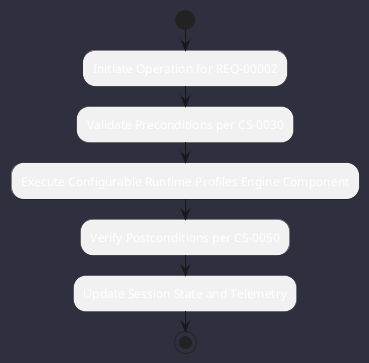

# REQ-00002: Configurable Runtime Profiles

## Requirement Metadata

| Property | Value |
|---|---|
| **Requirement ID** | `REQ-00002` |
| **Title** | Configurable Runtime Profiles |
| **Traceability** | [ADR-0011](../knowledge/knowledge_base.md) |
| **Priority** | High |
| **Verification Method** | Spring Boot Context Test |
| **Status** | Implemented |

## Description

The runtime shall support isolated Spring profiles: `tui` (terminal only), `web` (headless server only), and `dual` (both concurrent).

## Rationale & Context

Permits deployment in headless Linux containers or pure local terminal workflows.

## Architecture Specification & Activity Flow

## Acceptance & Verification Criteria

1. **Functional Compliance**: The implementation satisfies all criteria defined in [ADR-0011](../knowledge/knowledge_base.md).
2. **Quality Gate**: Code conforms strictly to `CS-0010` through `CS-0070` with zero Checkstyle/PMD warnings.
3. **Automated Testing**: Covered by automated unit/integration tests verified via `Spring Boot Context Test`.
4. **Documentation**: Fully indexed in the [Requirements Register](requirements_index.md).
