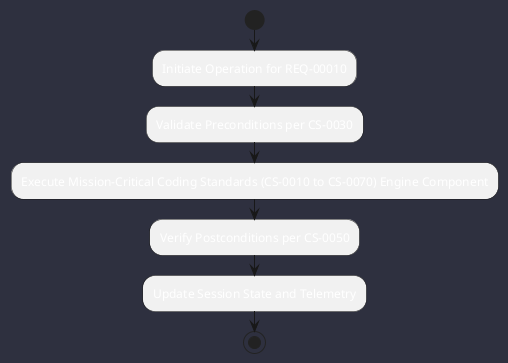

# REQ-00010: Mission-Critical Coding Standards (CS-0010 to CS-0070)

## Requirement Metadata

| Property | Value |
|---|---|
| **Requirement ID** | `REQ-00010` |
| **Title** | Mission-Critical Coding Standards (CS-0010 to CS-0070) |
| **Traceability** | [ADR-0002](../knowledge/knowledge_base.md) |
| **Priority** | Critical |
| **Verification Method** | Checkstyle & PMD Static Gate |
| **Status** | Implemented |

## Description

All Java code across all modules shall strictly adhere to zero-tolerance Checkstyle and PMD rules with no wildcard imports, explicit braces, package Javadoc, and preconditions.

## Rationale & Context

Ensures industrial grade maintainability and reliability.

## Architecture Specification & Activity Flow

## Acceptance & Verification Criteria

1. **Functional Compliance**: The implementation satisfies all criteria defined in [ADR-0002](../knowledge/knowledge_base.md).
2. **Quality Gate**: Code conforms strictly to `CS-0010` through `CS-0070` with zero Checkstyle/PMD warnings.
3. **Automated Testing**: Covered by automated unit/integration tests verified via `Checkstyle & PMD Static Gate`.
4. **Documentation**: Fully indexed in the [Requirements Register](requirements_index.md).
