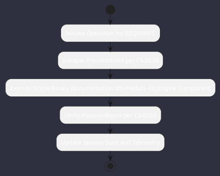

# REQ-00015: Single-Binary Documentation Kit (mkdocs-kit)

## Requirement Metadata

| Property | Value |
|---|---|
| **Requirement ID** | `REQ-00015` |
| **Title** | Single-Binary Documentation Kit (mkdocs-kit) |
| **Traceability** | [ADR-0003](../knowledge/knowledge_base.md) |
| **Priority** | High |
| **Verification Method** | helpers/build-docs.sh Execution |
| **Status** | Implemented |

## Description

The documentation shall compile to responsive HTML5 site and printable PDF manuals with embedded PlantUML vector diagrams via mkdocs-kit.

## Rationale & Context

Delivers self-contained, offline-accessible technical documentation.

## Architecture Specification & Activity Flow

## Acceptance & Verification Criteria

1. **Functional Compliance**: The implementation satisfies all criteria defined in [ADR-0003](../knowledge/knowledge_base.md).
2. **Quality Gate**: Code conforms strictly to `CS-0010` through `CS-0070` with zero Checkstyle/PMD warnings.
3. **Automated Testing**: Covered by automated unit/integration tests verified via `helpers/build-docs.sh Execution`.
4. **Documentation**: Fully indexed in the [Requirements Register](requirements_index.md).
