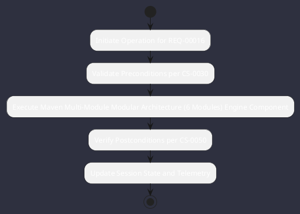

# REQ-00016: Maven Multi-Module Modular Architecture (6 Modules)

## Requirement Metadata

| Property | Value |
|---|---|
| **Requirement ID** | `REQ-00016` |
| **Title** | Maven Multi-Module Modular Architecture (6 Modules) |
| **Traceability** | [ADR-0016](../knowledge/knowledge_base.md) |
| **Priority** | Critical |
| **Verification Method** | mvn clean test Multi-Module Build |
| **Status** | Implemented |

## Description

The codebase shall be partitioned into 6 decoupled Maven modules: omniwrench-core, omniwrench-tools, omniwrench-ai, omniwrench-tui, omniwrench-web, omniwrench-app under a root BOM.

## Rationale & Context

Enforces strict layer decoupling and prevents monolithic cyclic dependencies.

## Architecture Specification & Activity Flow

## Acceptance & Verification Criteria

1. **Functional Compliance**: The implementation satisfies all criteria defined in [ADR-0016](../knowledge/knowledge_base.md).
2. **Quality Gate**: Code conforms strictly to `CS-0010` through `CS-0070` with zero Checkstyle/PMD warnings.
3. **Automated Testing**: Covered by automated unit/integration tests verified via `mvn clean test Multi-Module Build`.
4. **Documentation**: Fully indexed in the [Requirements Register](requirements_index.md).
