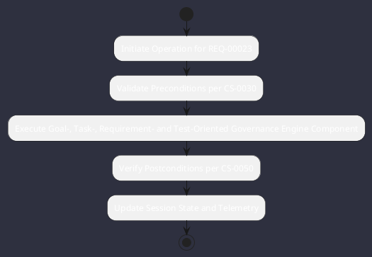

# REQ-00023: Goal-, Task-, Requirement- and Test-Oriented Governance

## Requirement Metadata

| Property | Value |
|---|---|
| **Requirement ID** | `REQ-00023` |
| **Title** | Goal-, Task-, Requirement- and Test-Oriented Governance |
| **Traceability** | [ADR-0023](../knowledge/knowledge_base.md) |
| **Priority** | High |
| **Verification Method** | Living Matrix & Task Audit |
| **Status** | Implemented |

## Description

Project governance shall be managed exclusively via living markdown task records (TSK-*) and traceability matrices in documentation without calendar sprint constraints.

## Rationale & Context

Aligns project progress strictly with verifiable technical objectives and industrial constraints.

## Architecture Specification & Activity Flow

## Acceptance & Verification Criteria

1. **Functional Compliance**: The implementation satisfies all criteria defined in [ADR-0023](../knowledge/knowledge_base.md).
2. **Quality Gate**: Code conforms strictly to `CS-0010` through `CS-0070` with zero Checkstyle/PMD warnings.
3. **Automated Testing**: Covered by automated unit/integration tests verified via `Living Matrix & Task Audit`.
4. **Documentation**: Fully indexed in the [Requirements Register](requirements_index.md).
