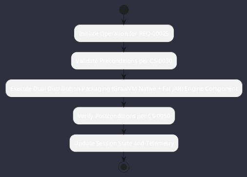

# REQ-00025: Dual Distribution Packaging (GraalVM Native + Fat JAR)

## Requirement Metadata

| Property | Value |
|---|---|
| **Requirement ID** | `REQ-00025` |
| **Title** | Dual Distribution Packaging (GraalVM Native + Fat JAR) |
| **Traceability** | [ADR-0025](../knowledge/knowledge_base.md) |
| **Priority** | High |
| **Verification Method** | AOT Native Build & JAR Verify |
| **Status** | Specified |

## Description

Omniwrench shall package into both a GraalVM AOT native binary (<20ms startup) and a Spring Boot executable Fat JAR.

## Rationale & Context

Provides instant CLI utility execution alongside enterprise server deployability.

## Architecture Specification & Activity Flow

## Acceptance & Verification Criteria

1. **Functional Compliance**: The implementation satisfies all criteria defined in [ADR-0025](../knowledge/knowledge_base.md).
2. **Quality Gate**: Code conforms strictly to `CS-0010` through `CS-0070` with zero Checkstyle/PMD warnings.
3. **Automated Testing**: Covered by automated unit/integration tests verified via `AOT Native Build & JAR Verify`.
4. **Documentation**: Fully indexed in the [Requirements Register](requirements_index.md).
