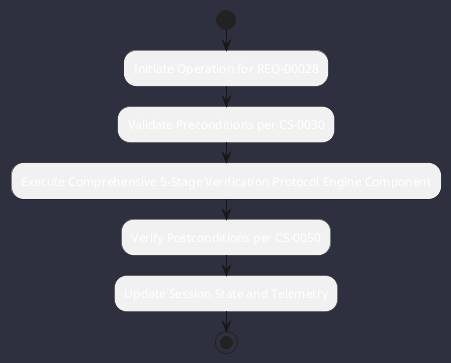

# REQ-00028: Comprehensive 5-Stage Verification Protocol

## Requirement Metadata

| Property | Value |
|---|---|
| **Requirement ID** | `REQ-00028` |
| **Title** | Comprehensive 5-Stage Verification Protocol |
| **Traceability** | [ADR-0028](../knowledge/knowledge_base.md) |
| **Priority** | Critical |
| **Verification Method** | CI/CD Pipeline & Helper Verify |
| **Status** | Implemented |

## Description

All code commits and releases shall pass a 5-stage verification gate: Compile -> Checkstyle/PMD -> Test -> Doc -> Deletion Impact.

## Rationale & Context

Guarantees zero regressions and strict quality gate compliance.

## Architecture Specification & Activity Flow

## Acceptance & Verification Criteria

1. **Functional Compliance**: The implementation satisfies all criteria defined in [ADR-0028](../knowledge/knowledge_base.md).
2. **Quality Gate**: Code conforms strictly to `CS-0010` through `CS-0070` with zero Checkstyle/PMD warnings.
3. **Automated Testing**: Covered by automated unit/integration tests verified via `CI/CD Pipeline & Helper Verify`.
4. **Documentation**: Fully indexed in the [Requirements Register](requirements_index.md).
