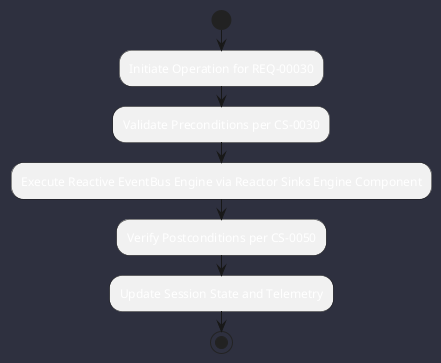

# REQ-00030: Reactive EventBus Engine via Reactor Sinks

## Requirement Metadata

| Property | Value |
|---|---|
| **Requirement ID** | `REQ-00030` |
| **Title** | Reactive EventBus Engine via Reactor Sinks |
| **Traceability** | [ADR-0030](../knowledge/knowledge_base.md) |
| **Priority** | High |
| **Verification Method** | Reactive Event Multicast Test |
| **Status** | Implemented |

## Description

The core engine shall provide a non-blocking type-safe EventBus backed by Project Reactor Sinks.Many with multicast replay and backpressure.

## Rationale & Context

Decouples reasoning publishers from UI consumers and network protocol listeners.

## Architecture Specification & Activity Flow

## Acceptance & Verification Criteria

1. **Functional Compliance**: The implementation satisfies all criteria defined in [ADR-0030](../knowledge/knowledge_base.md).
2. **Quality Gate**: Code conforms strictly to `CS-0010` through `CS-0070` with zero Checkstyle/PMD warnings.
3. **Automated Testing**: Covered by automated unit/integration tests verified via `Reactive Event Multicast Test`.
4. **Documentation**: Fully indexed in the [Requirements Register](requirements_index.md).
