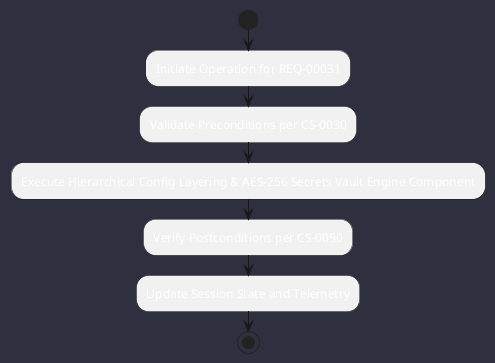

# REQ-00031: Hierarchical Config Layering & AES-256 Secrets Vault

## Requirement Metadata

| Property | Value |
|---|---|
| **Requirement ID** | `REQ-00031` |
| **Title** | Hierarchical Config Layering & AES-256 Secrets Vault |
| **Traceability** | [ADR-0031](../knowledge/knowledge_base.md) |
| **Priority** | High |
| **Verification Method** | Secret Masking & Encryption Test |
| **Status** | Specified |

## Description

Configuration shall follow strict precedence (CLI > Env > Workspace YAML > User YAML > Defaults) with secrets masked in logs and encrypted in .omniwrench/secrets.enc via AES-256-GCM.

## Rationale & Context

Guarantees secure credential handling across heterogeneous workstations and servers.

## Architecture Specification & Activity Flow

## Acceptance & Verification Criteria

1. **Functional Compliance**: The implementation satisfies all criteria defined in [ADR-0031](../knowledge/knowledge_base.md).
2. **Quality Gate**: Code conforms strictly to `CS-0010` through `CS-0070` with zero Checkstyle/PMD warnings.
3. **Automated Testing**: Covered by automated unit/integration tests verified via `Secret Masking & Encryption Test`.
4. **Documentation**: Fully indexed in the [Requirements Register](requirements_index.md).
