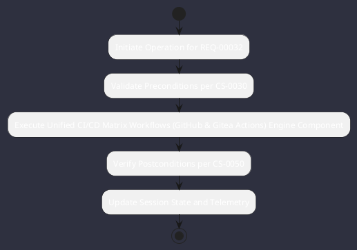

# REQ-00032: Unified CI/CD Matrix Workflows (GitHub & Gitea Actions)

## Requirement Metadata

| Property | Value |
|---|---|
| **Requirement ID** | `REQ-00032` |
| **Title** | Unified CI/CD Matrix Workflows (GitHub & Gitea Actions) |
| **Traceability** | [ADR-0032](../knowledge/knowledge_base.md) |
| **Priority** | High |
| **Verification Method** | GitHub/Gitea CI Workflow Run |
| **Status** | Implemented |

## Description

CI workflows shall execute on both GitHub and Gitea Actions testing JDK 21 matrix, Checkstyle/PMD linting, test suites, and mkdocs-kit build.

## Rationale & Context

Provides portable and reliable multi-remote continuous integration.

## Architecture Specification & Activity Flow

## Acceptance & Verification Criteria

1. **Functional Compliance**: The implementation satisfies all criteria defined in [ADR-0032](../knowledge/knowledge_base.md).
2. **Quality Gate**: Code conforms strictly to `CS-0010` through `CS-0070` with zero Checkstyle/PMD warnings.
3. **Automated Testing**: Covered by automated unit/integration tests verified via `GitHub/Gitea CI Workflow Run`.
4. **Documentation**: Fully indexed in the [Requirements Register](requirements_index.md).
