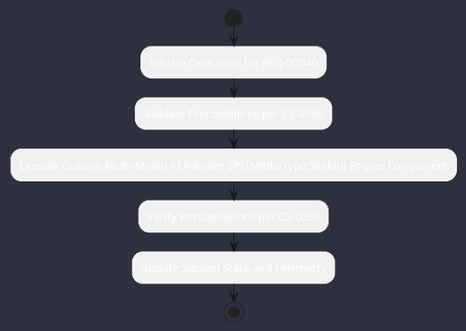

# REQ-00040: Custom Multi-Modal AI Adapter SPI (MediaType Sealed)

## Requirement Metadata

| Property | Value |
|---|---|
| **Requirement ID** | `REQ-00040` |
| **Title** | Custom Multi-Modal AI Adapter SPI (MediaType Sealed) |
| **Traceability** | [ADR-0015](../knowledge/knowledge_base.md) |
| **Priority** | Critical |
| **Verification Method** | Typed Generic Serialization Test |
| **Status** | Implemented |

## Description

The AI layer shall expose a BackendAdapter<T> SPI with a sealed MediaType hierarchy supporting chat, vision, embeddings, audio, and dataflow streams.

## Rationale & Context

Provides a future-proof, compile-time verified multi-modal inference contract.

## Architecture Specification & Activity Flow

## Acceptance & Verification Criteria

1. **Functional Compliance**: The implementation satisfies all criteria defined in [ADR-0015](../knowledge/knowledge_base.md).
2. **Quality Gate**: Code conforms strictly to `CS-0010` through `CS-0070` with zero Checkstyle/PMD warnings.
3. **Automated Testing**: Covered by automated unit/integration tests verified via `Typed Generic Serialization Test`.
4. **Documentation**: Fully indexed in the [Requirements Register](requirements_index.md).
