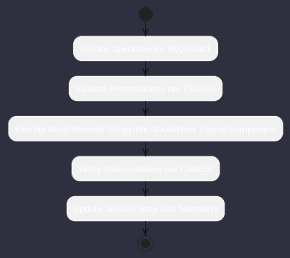

# REQ-00041: Multi-Provider Pluggable AI Adapters

## Requirement Metadata

| Property | Value |
|---|---|
| **Requirement ID** | `REQ-00041` |
| **Title** | Multi-Provider Pluggable AI Adapters |
| **Traceability** | [ADR-0004](../knowledge/knowledge_base.md) |
| **Priority** | High |
| **Verification Method** | Provider Integration Test |
| **Status** | Implemented |

## Description

The AI layer shall support pluggable adapters for OpenAI, Anthropic, Gemini, Ollama, vLLM, and Llama.cpp.

## Rationale & Context

Avoids vendor lock-in and permits local on-premise execution.

## Architecture Specification & Activity Flow

## Acceptance & Verification Criteria

1. **Functional Compliance**: The implementation satisfies all criteria defined in [ADR-0004](../knowledge/knowledge_base.md).
2. **Quality Gate**: Code conforms strictly to `CS-0010` through `CS-0070` with zero Checkstyle/PMD warnings.
3. **Automated Testing**: Covered by automated unit/integration tests verified via `Provider Integration Test`.
4. **Documentation**: Fully indexed in the [Requirements Register](requirements_index.md).
