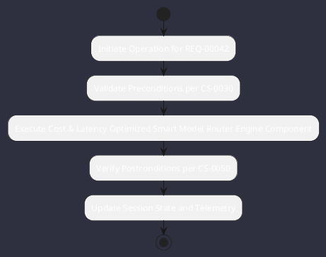

# REQ-00042: Cost & Latency Optimized Smart Model Router

## Requirement Metadata

| Property | Value |
|---|---|
| **Requirement ID** | `REQ-00042` |
| **Title** | Cost & Latency Optimized Smart Model Router |
| **Traceability** | [ADR-0019](../knowledge/knowledge_base.md) |
| **Priority** | High |
| **Verification Method** | Model Routing Tier Benchmark |
| **Status** | Specified |

## Description

The engine shall dynamically route prompts across complexity tiers (TRIVIAL to EXPERT) to minimize API latency and budget consumption.

## Rationale & Context

Optimizes execution speed and cost efficiency.

## Architecture Specification & Activity Flow

## Acceptance & Verification Criteria

1. **Functional Compliance**: The implementation satisfies all criteria defined in [ADR-0019](../knowledge/knowledge_base.md).
2. **Quality Gate**: Code conforms strictly to `CS-0010` through `CS-0070` with zero Checkstyle/PMD warnings.
3. **Automated Testing**: Covered by automated unit/integration tests verified via `Model Routing Tier Benchmark`.
4. **Documentation**: Fully indexed in the [Requirements Register](requirements_index.md).
