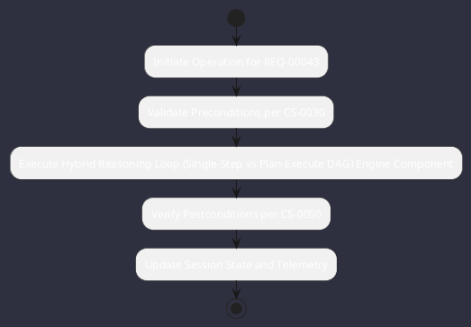

# REQ-00043: Hybrid Reasoning Loop (Single-Step vs Plan-Execute DAG)

## Requirement Metadata

| Property | Value |
|---|---|
| **Requirement ID** | `REQ-00043` |
| **Title** | Hybrid Reasoning Loop (Single-Step vs Plan-Execute DAG) |
| **Traceability** | [ADR-0008](../knowledge/knowledge_base.md) |
| **Priority** | Critical |
| **Verification Method** | Complexity Heuristic & DAG Test |
| **Status** | Specified |

## Description

The agent engine shall auto-switch between single-turn reactive tool execution and multi-step Plan-and-Execute DAGs based on prompt complexity.

## Rationale & Context

Provides instant responses for simple queries while structuring complex multi-file refactorings.

## Architecture Specification & Activity Flow

## Acceptance & Verification Criteria

1. **Functional Compliance**: The implementation satisfies all criteria defined in [ADR-0008](../knowledge/knowledge_base.md).
2. **Quality Gate**: Code conforms strictly to `CS-0010` through `CS-0070` with zero Checkstyle/PMD warnings.
3. **Automated Testing**: Covered by automated unit/integration tests verified via `Complexity Heuristic & DAG Test`.
4. **Documentation**: Fully indexed in the [Requirements Register](requirements_index.md).
