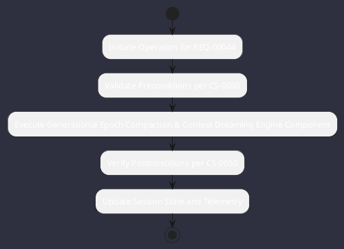

# REQ-00044: Generational Epoch Compaction & Context Dreaming

## Requirement Metadata

| Property | Value |
|---|---|
| **Requirement ID** | `REQ-00044` |
| **Title** | Generational Epoch Compaction & Context Dreaming |
| **Traceability** | [ADR-0033](../knowledge/knowledge_base.md) |
| **Priority** | High |
| **Verification Method** | Token Threshold Compaction Test |
| **Status** | Specified |

## Description

When conversation tokens exceed 75% of context window, a background worker shall distill history into summary blocks and rotate session epochs.

## Rationale & Context

Prevents context overflow and reduces token costs during multi-day tasks.

## Architecture Specification & Activity Flow

## Acceptance & Verification Criteria

1. **Functional Compliance**: The implementation satisfies all criteria defined in [ADR-0033](../knowledge/knowledge_base.md).
2. **Quality Gate**: Code conforms strictly to `CS-0010` through `CS-0070` with zero Checkstyle/PMD warnings.
3. **Automated Testing**: Covered by automated unit/integration tests verified via `Token Threshold Compaction Test`.
4. **Documentation**: Fully indexed in the [Requirements Register](requirements_index.md).
