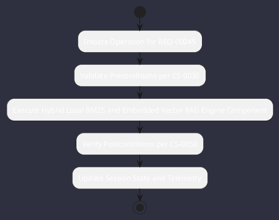

# REQ-00045: Hybrid Local BM25 and Embedded Vector RAG

## Requirement Metadata

| Property | Value |
|---|---|
| **Requirement ID** | `REQ-00045` |
| **Title** | Hybrid Local BM25 and Embedded Vector RAG |
| **Traceability** | [ADR-0027](../knowledge/knowledge_base.md) |
| **Priority** | High |
| **Verification Method** | RRF Context Retrieval Test |
| **Status** | Specified |

## Description

The engine shall index workspace code and documentation using local BM25 keyword matching and embedded vector search fused via Reciprocal Rank Fusion.

## Rationale & Context

Delivers fast, high-relevance symbol retrieval without cloud dependencies.

## Architecture Specification & Activity Flow

## Acceptance & Verification Criteria

1. **Functional Compliance**: The implementation satisfies all criteria defined in [ADR-0027](../knowledge/knowledge_base.md).
2. **Quality Gate**: Code conforms strictly to `CS-0010` through `CS-0070` with zero Checkstyle/PMD warnings.
3. **Automated Testing**: Covered by automated unit/integration tests verified via `RRF Context Retrieval Test`.
4. **Documentation**: Fully indexed in the [Requirements Register](requirements_index.md).
