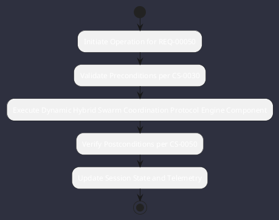

# REQ-00050: Dynamic Hybrid Swarm Coordination Protocol

## Requirement Metadata

| Property | Value |
|---|---|
| **Requirement ID** | `REQ-00050` |
| **Title** | Dynamic Hybrid Swarm Coordination Protocol |
| **Traceability** | [ADR-0017](../knowledge/knowledge_base.md) |
| **Priority** | High |
| **Verification Method** | Swarm Concurrency & DAG Test |
| **Status** | Specified |

## Description

The engine shall support hierarchical supervisor delegation combined with ephemeral peer-to-peer subagent consensus swarms.

## Rationale & Context

Enables multi-perspective code review and architectural debate.

## Architecture Specification & Activity Flow

## Acceptance & Verification Criteria

1. **Functional Compliance**: The implementation satisfies all criteria defined in [ADR-0017](../knowledge/knowledge_base.md).
2. **Quality Gate**: Code conforms strictly to `CS-0010` through `CS-0070` with zero Checkstyle/PMD warnings.
3. **Automated Testing**: Covered by automated unit/integration tests verified via `Swarm Concurrency & DAG Test`.
4. **Documentation**: Fully indexed in the [Requirements Register](requirements_index.md).
