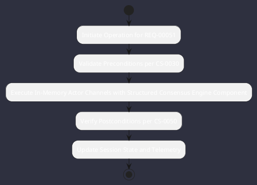

# REQ-00051: In-Memory Actor Channels with Structured Consensus

## Requirement Metadata

| Property | Value |
|---|---|
| **Requirement ID** | `REQ-00051` |
| **Title** | In-Memory Actor Channels with Structured Consensus |
| **Traceability** | [ADR-0035](../knowledge/knowledge_base.md) |
| **Priority** | High |
| **Verification Method** | Quorum Voting & Timeout Test |
| **Status** | Specified |

## Description

Subagents shall run in virtual thread actors exchanging immutable SwarmEnvelope messages with quorum voting rounds (>=66% threshold).

## Rationale & Context

Prevents concurrency deadlocks and ensures deterministic decision convergence.

## Architecture Specification & Activity Flow

## Acceptance & Verification Criteria

1. **Functional Compliance**: The implementation satisfies all criteria defined in [ADR-0035](../knowledge/knowledge_base.md).
2. **Quality Gate**: Code conforms strictly to `CS-0010` through `CS-0070` with zero Checkstyle/PMD warnings.
3. **Automated Testing**: Covered by automated unit/integration tests verified via `Quorum Voting & Timeout Test`.
4. **Documentation**: Fully indexed in the [Requirements Register](requirements_index.md).
