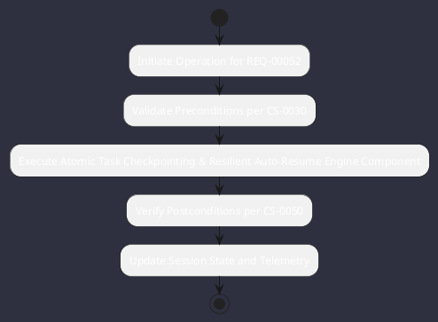

# REQ-00052: Atomic Task Checkpointing & Resilient Auto-Resume

## Requirement Metadata

| Property | Value |
|---|---|
| **Requirement ID** | `REQ-00052` |
| **Title** | Atomic Task Checkpointing & Resilient Auto-Resume |
| **Traceability** | [ADR-0021](../knowledge/knowledge_base.md) |
| **Priority** | Critical |
| **Verification Method** | Process Interruption & Resume Test |
| **Status** | Specified |

## Description

Task DAG steps shall be recorded atomically under .omniwrench/tasks/{taskId}/steps/{stepId}.json with auto-resume on interruption.

## Rationale & Context

Guarantees zero work loss during power failure or process restarts.

## Architecture Specification & Activity Flow

## Acceptance & Verification Criteria

1. **Functional Compliance**: The implementation satisfies all criteria defined in [ADR-0021](../knowledge/knowledge_base.md).
2. **Quality Gate**: Code conforms strictly to `CS-0010` through `CS-0070` with zero Checkstyle/PMD warnings.
3. **Automated Testing**: Covered by automated unit/integration tests verified via `Process Interruption & Resume Test`.
4. **Documentation**: Fully indexed in the [Requirements Register](requirements_index.md).
