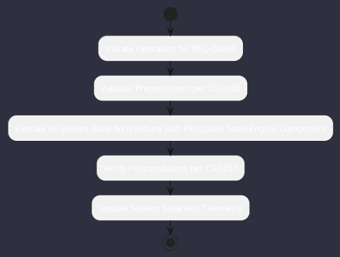

# REQ-00060: Polyvalent Base Architecture with Pluggable Tools

## Requirement Metadata

| Property | Value |
|---|---|
| **Requirement ID** | `REQ-00060` |
| **Title** | Polyvalent Base Architecture with Pluggable Tools |
| **Traceability** | [ADR-0006](../knowledge/knowledge_base.md) |
| **Priority** | Critical |
| **Verification Method** | Tool SPI Registry Test |
| **Status** | Implemented |

## Description

Omniwrench base engine shall be domain-agnostic with capabilities provided via pluggable tools and behavioral extensions.

## Rationale & Context

Permits flexible specialization across software, devops, and home automation.

## Architecture Specification & Activity Flow

## Acceptance & Verification Criteria

1. **Functional Compliance**: The implementation satisfies all criteria defined in [ADR-0006](../knowledge/knowledge_base.md).
2. **Quality Gate**: Code conforms strictly to `CS-0010` through `CS-0070` with zero Checkstyle/PMD warnings.
3. **Automated Testing**: Covered by automated unit/integration tests verified via `Tool SPI Registry Test`.
4. **Documentation**: Fully indexed in the [Requirements Register](requirements_index.md).
