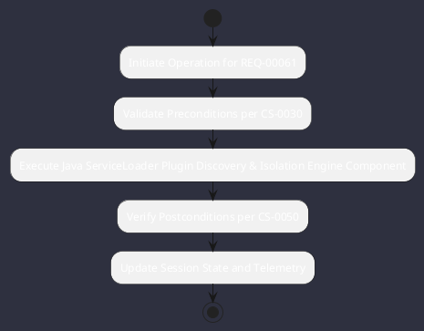

# REQ-00061: Java ServiceLoader Plugin Discovery & Isolation

## Requirement Metadata

| Property | Value |
|---|---|
| **Requirement ID** | `REQ-00061` |
| **Title** | Java ServiceLoader Plugin Discovery & Isolation |
| **Traceability** | [ADR-0010](../knowledge/knowledge_base.md) |
| **Priority** | High |
| **Verification Method** | Plugin URLClassLoader Test |
| **Status** | Specified |

## Description

Third-party plugin JARs in plugins/ shall be discovered via Java ServiceLoader and isolated in dedicated child classloaders.

## Rationale & Context

Guarantees modularity and prevents dependency classpath conflicts.

## Architecture Specification & Activity Flow

## Acceptance & Verification Criteria

1. **Functional Compliance**: The implementation satisfies all criteria defined in [ADR-0010](../knowledge/knowledge_base.md).
2. **Quality Gate**: Code conforms strictly to `CS-0010` through `CS-0070` with zero Checkstyle/PMD warnings.
3. **Automated Testing**: Covered by automated unit/integration tests verified via `Plugin URLClassLoader Test`.
4. **Documentation**: Fully indexed in the [Requirements Register](requirements_index.md).
