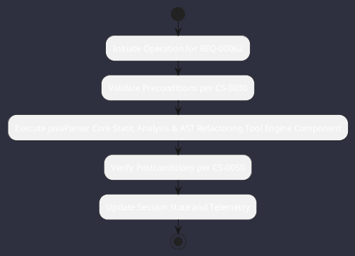

# REQ-00062: JavaParser Core Static Analysis & AST Refactoring Tool

## Requirement Metadata

| Property | Value |
|---|---|
| **Requirement ID** | `REQ-00062` |
| **Title** | JavaParser Core Static Analysis & AST Refactoring Tool |
| **Traceability** | [ADR-0024](../knowledge/knowledge_base.md) |
| **Priority** | High |
| **Verification Method** | Lexical Preservation AST Test |
| **Status** | Specified |

## Description

The AST refactoring tool shall use JavaParser with LexicalPreservingPrinter for comment-safe, formatting-preserving code modifications.

## Rationale & Context

Prevents destructive code rewriting and preserves human developer comments.

## Architecture Specification & Activity Flow

## Acceptance & Verification Criteria

1. **Functional Compliance**: The implementation satisfies all criteria defined in [ADR-0024](../knowledge/knowledge_base.md).
2. **Quality Gate**: Code conforms strictly to `CS-0010` through `CS-0070` with zero Checkstyle/PMD warnings.
3. **Automated Testing**: Covered by automated unit/integration tests verified via `Lexical Preservation AST Test`.
4. **Documentation**: Fully indexed in the [Requirements Register](requirements_index.md).
