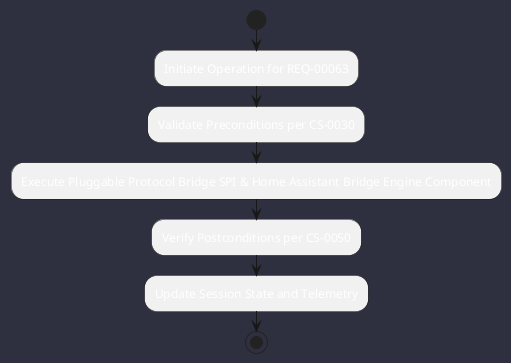

# REQ-00063: Pluggable Protocol Bridge SPI & Home Assistant Bridge

## Requirement Metadata

| Property | Value |
|---|---|
| **Requirement ID** | `REQ-00063` |
| **Title** | Pluggable Protocol Bridge SPI & Home Assistant Bridge |
| **Traceability** | [ADR-0029](../knowledge/knowledge_base.md) |
| **Priority** | High |
| **Verification Method** | WebSocket / REST Event Test |
| **Status** | Implemented |

## Description

The engine shall provide a ProtocolBridge SPI and HomeAssistantTool connecting to Home Assistant REST and WebSocket event APIs.

## Rationale & Context

Enables smart device telemetry ingestion and IoT automation triggers.

## Architecture Specification & Activity Flow

## Acceptance & Verification Criteria

1. **Functional Compliance**: The implementation satisfies all criteria defined in [ADR-0029](../knowledge/knowledge_base.md).
2. **Quality Gate**: Code conforms strictly to `CS-0010` through `CS-0070` with zero Checkstyle/PMD warnings.
3. **Automated Testing**: Covered by automated unit/integration tests verified via `WebSocket / REST Event Test`.
4. **Documentation**: Fully indexed in the [Requirements Register](requirements_index.md).
