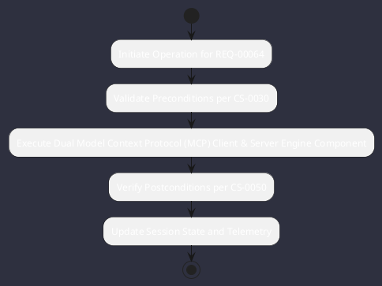

# REQ-00064: Dual Model Context Protocol (MCP) Client & Server

## Requirement Metadata

| Property | Value |
|---|---|
| **Requirement ID** | `REQ-00064` |
| **Title** | Dual Model Context Protocol (MCP) Client & Server |
| **Traceability** | [ADR-0036](../knowledge/knowledge_base.md) |
| **Priority** | High |
| **Verification Method** | Stdio/SSE MCP Handshake Test |
| **Status** | Specified |

## Description

Omniwrench shall act as an MCP Client (consuming external Stdio/SSE MCP servers) and as an MCP Server exposing tools to IDEs.

## Rationale & Context

Enables bidirectional interoperability across the AI tooling ecosystem.

## Architecture Specification & Activity Flow

## Acceptance & Verification Criteria

1. **Functional Compliance**: The implementation satisfies all criteria defined in [ADR-0036](../knowledge/knowledge_base.md).
2. **Quality Gate**: Code conforms strictly to `CS-0010` through `CS-0070` with zero Checkstyle/PMD warnings.
3. **Automated Testing**: Covered by automated unit/integration tests verified via `Stdio/SSE MCP Handshake Test`.
4. **Documentation**: Fully indexed in the [Requirements Register](requirements_index.md).
