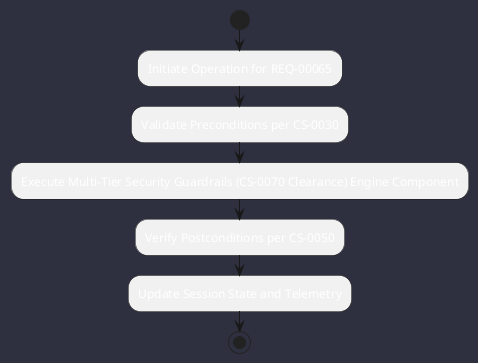

# REQ-00065: Multi-Tier Security Guardrails (CS-0070 Clearance)

## Requirement Metadata

| Property | Value |
|---|---|
| **Requirement ID** | `REQ-00065` |
| **Title** | Multi-Tier Security Guardrails (CS-0070 Clearance) |
| **Traceability** | [ADR-0020](../knowledge/knowledge_base.md) |
| **Priority** | Critical |
| **Verification Method** | Command Safety Classifier Test |
| **Status** | Specified |

## Description

All tool actions shall be classified (Levels 1-9) with path containment and mandatory human clearance for destructive operations per CS-0070.

## Rationale & Context

Prevents unauthorized file deletion, out-of-bounds mutation, or dangerous process execution.

## Architecture Specification & Activity Flow

## Acceptance & Verification Criteria

1. **Functional Compliance**: The implementation satisfies all criteria defined in [ADR-0020](../knowledge/knowledge_base.md).
2. **Quality Gate**: Code conforms strictly to `CS-0010` through `CS-0070` with zero Checkstyle/PMD warnings.
3. **Automated Testing**: Covered by automated unit/integration tests verified via `Command Safety Classifier Test`.
4. **Documentation**: Fully indexed in the [Requirements Register](requirements_index.md).
