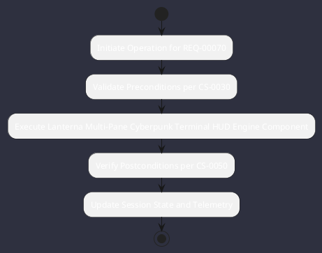

# REQ-00070: Lanterna Multi-Pane Cyberpunk Terminal HUD

## Requirement Metadata

| Property | Value |
|---|---|
| **Requirement ID** | `REQ-00070` |
| **Title** | Lanterna Multi-Pane Cyberpunk Terminal HUD |
| **Traceability** | [ADR-0005](../knowledge/knowledge_base.md) |
| **Priority** | High |
| **Verification Method** | TUI Rendering & Snapshot Test |
| **Status** | Implemented |

## Description

The TUI shall render a multi-pane Cyberpunk terminal dashboard with glowing neon cyan/magenta styling and live status badges.

## Rationale & Context

Provides a high-ergonomics, visually distinct terminal development workbench.

## Architecture Specification & Activity Flow

## Acceptance & Verification Criteria

1. **Functional Compliance**: The implementation satisfies all criteria defined in [ADR-0005](../knowledge/knowledge_base.md).
2. **Quality Gate**: Code conforms strictly to `CS-0010` through `CS-0070` with zero Checkstyle/PMD warnings.
3. **Automated Testing**: Covered by automated unit/integration tests verified via `TUI Rendering & Snapshot Test`.
4. **Documentation**: Fully indexed in the [Requirements Register](requirements_index.md).
