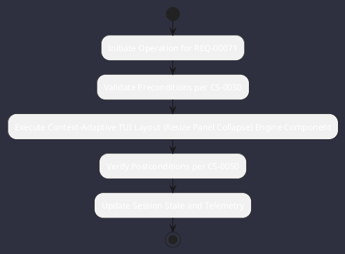

# REQ-00071: Context-Adaptive TUI Layout (Resize Panel Collapse)

## Requirement Metadata

| Property | Value |
|---|---|
| **Requirement ID** | `REQ-00071` |
| **Title** | Context-Adaptive TUI Layout (Resize Panel Collapse) |
| **Traceability** | [ADR-0013](../knowledge/knowledge_base.md) |
| **Priority** | High |
| **Verification Method** | SIGWINCH Resize Layout Test |
| **Status** | Specified |

## Description

The TUI layout shall adaptively collapse panels based on terminal columns (<80, 80-139, 140-159, >=160 cols).

## Rationale & Context

Ensures full readability on any terminal window size or split pane.

## Architecture Specification & Activity Flow

## Acceptance & Verification Criteria

1. **Functional Compliance**: The implementation satisfies all criteria defined in [ADR-0013](../knowledge/knowledge_base.md).
2. **Quality Gate**: Code conforms strictly to `CS-0010` through `CS-0070` with zero Checkstyle/PMD warnings.
3. **Automated Testing**: Covered by automated unit/integration tests verified via `SIGWINCH Resize Layout Test`.
4. **Documentation**: Fully indexed in the [Requirements Register](requirements_index.md).
