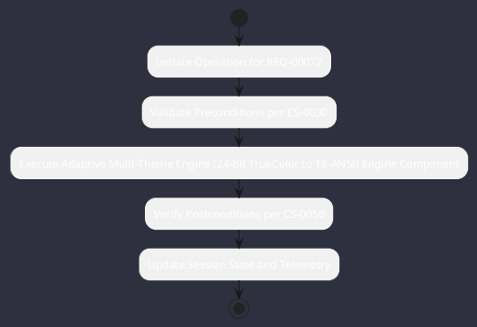

# REQ-00072: Adaptive Multi-Theme Engine (24-bit TrueColor to 16-ANSI)

## Requirement Metadata

| Property | Value |
|---|---|
| **Requirement ID** | `REQ-00072` |
| **Title** | Adaptive Multi-Theme Engine (24-bit TrueColor to 16-ANSI) |
| **Traceability** | [ADR-0034](../knowledge/knowledge_base.md) |
| **Priority** | Medium |
| **Verification Method** | Palette Quantization Test |
| **Status** | Specified |

## Description

The theme engine shall dynamically quantize 24-bit RGB values to 256/16 ANSI colors and support custom JSON themes in .omniwrench/themes/.

## Rationale & Context

Provides universal terminal color compatibility and aesthetic customizability.

## Architecture Specification & Activity Flow

## Acceptance & Verification Criteria

1. **Functional Compliance**: The implementation satisfies all criteria defined in [ADR-0034](../knowledge/knowledge_base.md).
2. **Quality Gate**: Code conforms strictly to `CS-0010` through `CS-0070` with zero Checkstyle/PMD warnings.
3. **Automated Testing**: Covered by automated unit/integration tests verified via `Palette Quantization Test`.
4. **Documentation**: Fully indexed in the [Requirements Register](requirements_index.md).
