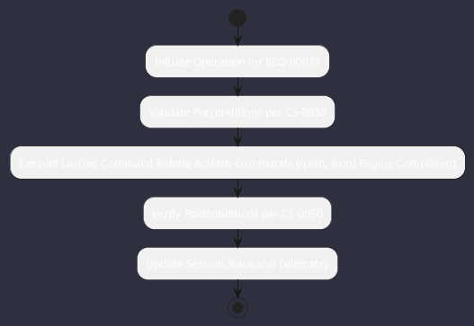

# REQ-00073: Unified Command Palette & Slash Commands (/plan, /run)

## Requirement Metadata

| Property | Value |
|---|---|
| **Requirement ID** | `REQ-00073` |
| **Title** | Unified Command Palette & Slash Commands (/plan, /run) |
| **Traceability** | [ADR-0022](../knowledge/knowledge_base.md) |
| **Priority** | High |
| **Verification Method** | Command Dispatcher Test |
| **Status** | Implemented |

## Description

The TUI and Web interfaces shall expose a unified command palette and slash commands (/plan, /run, /diff, /commit, /theme).

## Rationale & Context

Standardizes user interaction across CLI, TUI, and Web environments.

## Architecture Specification & Activity Flow

## Acceptance & Verification Criteria

1. **Functional Compliance**: The implementation satisfies all criteria defined in [ADR-0022](../knowledge/knowledge_base.md).
2. **Quality Gate**: Code conforms strictly to `CS-0010` through `CS-0070` with zero Checkstyle/PMD warnings.
3. **Automated Testing**: Covered by automated unit/integration tests verified via `Command Dispatcher Test`.
4. **Documentation**: Fully indexed in the [Requirements Register](requirements_index.md).
