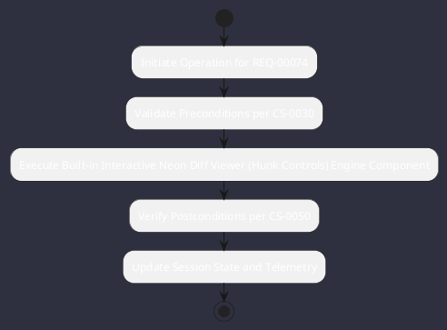

# REQ-00074: Built-in Interactive Neon Diff Viewer (Hunk Controls)

## Requirement Metadata

| Property | Value |
|---|---|
| **Requirement ID** | `REQ-00074` |
| **Title** | Built-in Interactive Neon Diff Viewer (Hunk Controls) |
| **Traceability** | [ADR-0026](../knowledge/knowledge_base.md) |
| **Priority** | High |
| **Verification Method** | Split Diff & Staging Test |
| **Status** | Specified |

## Description

The TUI shall provide a built-in split diff viewer with hunk-by-hunk staging (s) and reverting (r) keyboard shortcuts.

## Rationale & Context

Gives developers fine-grained control over AI-generated code modifications.

## Architecture Specification & Activity Flow

## Acceptance & Verification Criteria

1. **Functional Compliance**: The implementation satisfies all criteria defined in [ADR-0026](../knowledge/knowledge_base.md).
2. **Quality Gate**: Code conforms strictly to `CS-0010` through `CS-0070` with zero Checkstyle/PMD warnings.
3. **Automated Testing**: Covered by automated unit/integration tests verified via `Split Diff & Staging Test`.
4. **Documentation**: Fully indexed in the [Requirements Register](requirements_index.md).
