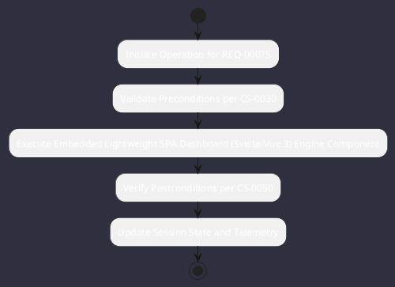

# REQ-00075: Embedded Lightweight SPA Dashboard (Svelte/Vue 3)

## Requirement Metadata

| Property | Value |
|---|---|
| **Requirement ID** | `REQ-00075` |
| **Title** | Embedded Lightweight SPA Dashboard (Svelte/Vue 3) |
| **Traceability** | [ADR-0018](../knowledge/knowledge_base.md) |
| **Priority** | High |
| **Verification Method** | Web HUD & WebSocket Test |
| **Status** | Implemented |

## Description

Spring Boot static resources shall bundle an embedded SPA web dashboard accessible at port 8080 streaming real-time telemetry over WebSockets.

## Rationale & Context

Allows browser-based inspection with zero separate frontend server installation.

## Architecture Specification & Activity Flow

## Acceptance & Verification Criteria

1. **Functional Compliance**: The implementation satisfies all criteria defined in [ADR-0018](../knowledge/knowledge_base.md).
2. **Quality Gate**: Code conforms strictly to `CS-0010` through `CS-0070` with zero Checkstyle/PMD warnings.
3. **Automated Testing**: Covered by automated unit/integration tests verified via `Web HUD & WebSocket Test`.
4. **Documentation**: Fully indexed in the [Requirements Register](requirements_index.md).
