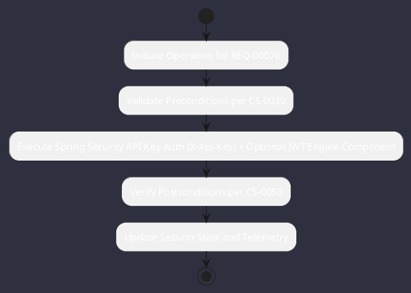

# REQ-00076: Spring Security API Key Auth (X-Api-Key) + Optional JWT

## Requirement Metadata

| Property | Value |
|---|---|
| **Requirement ID** | `REQ-00076` |
| **Title** | Spring Security API Key Auth (X-Api-Key) + Optional JWT |
| **Traceability** | [ADR-0012](../knowledge/knowledge_base.md) |
| **Priority** | High |
| **Verification Method** | HTTP 401/200 Security Test |
| **Status** | Implemented |

## Description

Web endpoints and WebSocket connections shall be secured with X-Api-Key header validation and optional JWT bearer tokens.

## Rationale & Context

Guarantees authorized access to agent controls and telemetry streams.

## Architecture Specification & Activity Flow

## Acceptance & Verification Criteria

1. **Functional Compliance**: The implementation satisfies all criteria defined in [ADR-0012](../knowledge/knowledge_base.md).
2. **Quality Gate**: Code conforms strictly to `CS-0010` through `CS-0070` with zero Checkstyle/PMD warnings.
3. **Automated Testing**: Covered by automated unit/integration tests verified via `HTTP 401/200 Security Test`.
4. **Documentation**: Fully indexed in the [Requirements Register](requirements_index.md).
