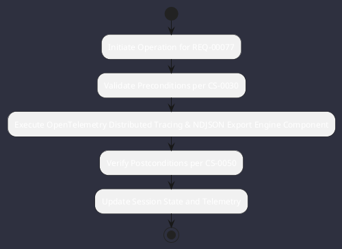

# REQ-00077: OpenTelemetry Distributed Tracing & NDJSON Export

## Requirement Metadata

| Property | Value |
|---|---|
| **Requirement ID** | `REQ-00077` |
| **Title** | OpenTelemetry Distributed Tracing & NDJSON Export |
| **Traceability** | [ADR-0014](../knowledge/knowledge_base.md) |
| **Priority** | High |
| **Verification Method** | OTLP Span Output Validation |
| **Status** | Implemented |

## Description

The runtime shall emit structured OpenTelemetry spans for every LLM turn and tool execution exported to .omniwrench/traces.ndjson.

## Rationale & Context

Provides full operational observability and performance profiling.

## Architecture Specification & Activity Flow

## Acceptance & Verification Criteria

1. **Functional Compliance**: The implementation satisfies all criteria defined in [ADR-0014](../knowledge/knowledge_base.md).
2. **Quality Gate**: Code conforms strictly to `CS-0010` through `CS-0070` with zero Checkstyle/PMD warnings.
3. **Automated Testing**: Covered by automated unit/integration tests verified via `OTLP Span Output Validation`.
4. **Documentation**: Fully indexed in the [Requirements Register](requirements_index.md).
