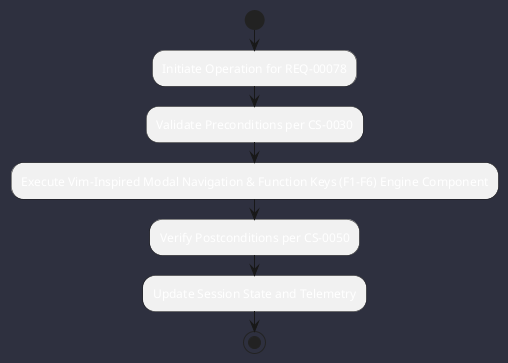

# REQ-00078: Vim-Inspired Modal Navigation & Function Keys (F1-F6)

## Requirement Metadata

| Property | Value |
|---|---|
| **Requirement ID** | `REQ-00078` |
| **Title** | Vim-Inspired Modal Navigation & Function Keys (F1-F6) |
| **Traceability** | [ADR-0037](../knowledge/knowledge_base.md) |
| **Priority** | High |
| **Verification Method** | Keymap & Focus Traversal Test |
| **Status** | Specified |

## Description

The TUI shall support modal navigation (Esc for normal mode, i for prompt mode, h/j/k/l navigation) and dedicated function keys F1-F6.

## Rationale & Context

Optimizes developer typing speed and ergonomics in terminal environments.

## Architecture Specification & Activity Flow

## Acceptance & Verification Criteria

1. **Functional Compliance**: The implementation satisfies all criteria defined in [ADR-0037](../knowledge/knowledge_base.md).
2. **Quality Gate**: Code conforms strictly to `CS-0010` through `CS-0070` with zero Checkstyle/PMD warnings.
3. **Automated Testing**: Covered by automated unit/integration tests verified via `Keymap & Focus Traversal Test`.
4. **Documentation**: Fully indexed in the [Requirements Register](requirements_index.md).
