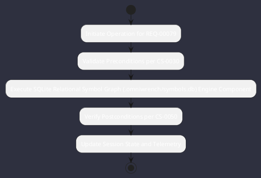

# REQ-00079: SQLite Relational Symbol Graph (.omniwrench/symbols.db)

## Requirement Metadata

| Property | Value |
|---|---|
| **Requirement ID** | `REQ-00079` |
| **Title** | SQLite Relational Symbol Graph (.omniwrench/symbols.db) |
| **Traceability** | [ADR-0038](../knowledge/knowledge_base.md) |
| **Priority** | High |
| **Verification Method** | SQL Symbol Relation Queries Test |
| **Status** | Specified |

## Description

AST symbol relationships (classes, methods, calls, extends) shall be persisted in an embedded SQLite database with FTS5 search and inotify updates.

## Rationale & Context

Enables sub-millisecond call-hierarchy and impact analysis queries.

## Architecture Specification & Activity Flow

## Acceptance & Verification Criteria

1. **Functional Compliance**: The implementation satisfies all criteria defined in [ADR-0038](../knowledge/knowledge_base.md).
2. **Quality Gate**: Code conforms strictly to `CS-0010` through `CS-0070` with zero Checkstyle/PMD warnings.
3. **Automated Testing**: Covered by automated unit/integration tests verified via `SQL Symbol Relation Queries Test`.
4. **Documentation**: Fully indexed in the [Requirements Register](requirements_index.md).
