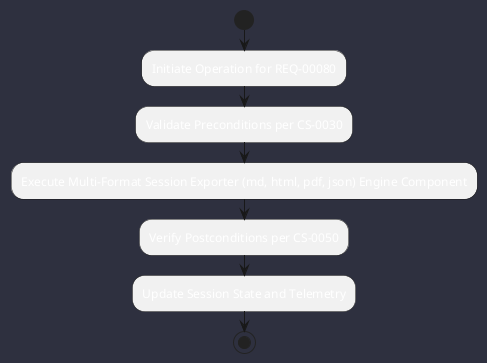

# REQ-00080: Multi-Format Session Exporter (md, html, pdf, json)

## Requirement Metadata

| Property | Value |
|---|---|
| **Requirement ID** | `REQ-00080` |
| **Title** | Multi-Format Session Exporter (md, html, pdf, json) |
| **Traceability** | [ADR-0039](../knowledge/knowledge_base.md) |
| **Priority** | High |
| **Verification Method** | Export Artifact Generation Test |
| **Status** | Specified |

## Description

The /export command shall generate Markdown with PlantUML, standalone HTML5, publication PDF, and structured JSON audit bundles.

## Rationale & Context

Facilitates seamless knowledge sharing with human teams and documentation systems.

## Architecture Specification & Activity Flow

## Acceptance & Verification Criteria

1. **Functional Compliance**: The implementation satisfies all criteria defined in [ADR-0039](../knowledge/knowledge_base.md).
2. **Quality Gate**: Code conforms strictly to `CS-0010` through `CS-0070` with zero Checkstyle/PMD warnings.
3. **Automated Testing**: Covered by automated unit/integration tests verified via `Export Artifact Generation Test`.
4. **Documentation**: Fully indexed in the [Requirements Register](requirements_index.md).
