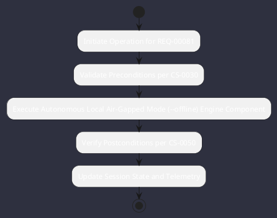

# REQ-00081: Autonomous Local Air-Gapped Mode (--offline)

## Requirement Metadata

| Property | Value |
|---|---|
| **Requirement ID** | `REQ-00081` |
| **Title** | Autonomous Local Air-Gapped Mode (--offline) |
| **Traceability** | [ADR-0040](../knowledge/knowledge_base.md) |
| **Priority** | Critical |
| **Verification Method** | Zero Egress Socket Filter Test |
| **Status** | Specified |

## Description

When launched with --offline, Omniwrench shall operate 100% air-gapped with local LLM routing, local SQLite symbols, and zero external egress.

## Rationale & Context

Guarantees confidential execution in secure and disconnected industrial environments.

## Architecture Specification & Activity Flow

## Acceptance & Verification Criteria

1. **Functional Compliance**: The implementation satisfies all criteria defined in [ADR-0040](../knowledge/knowledge_base.md).
2. **Quality Gate**: Code conforms strictly to `CS-0010` through `CS-0070` with zero Checkstyle/PMD warnings.
3. **Automated Testing**: Covered by automated unit/integration tests verified via `Zero Egress Socket Filter Test`.
4. **Documentation**: Fully indexed in the [Requirements Register](requirements_index.md).
