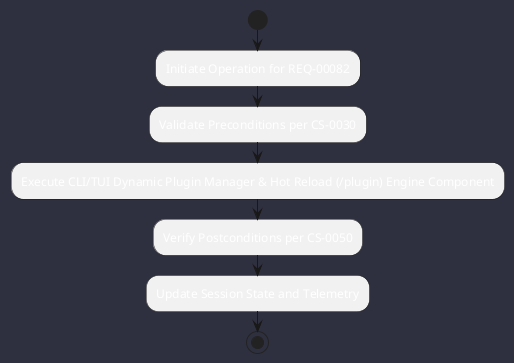

# REQ-00082: CLI/TUI Dynamic Plugin Manager & Hot Reload (/plugin)

## Requirement Metadata

| Property | Value |
|---|---|
| **Requirement ID** | `REQ-00082` |
| **Title** | CLI/TUI Dynamic Plugin Manager & Hot Reload (/plugin) |
| **Traceability** | [ADR-0041](../knowledge/knowledge_base.md) |
| **Priority** | High |
| **Verification Method** | PluginClassLoader Dynamic Reload Test |
| **Status** | Specified |

## Description

The /plugin command shall install, verify, list, and hot-reload third-party JAR plugins without stopping the running application.

## Rationale & Context

Enables continuous extension development and zero-downtime tool updates.

## Architecture Specification & Activity Flow

## Acceptance & Verification Criteria

1. **Functional Compliance**: The implementation satisfies all criteria defined in [ADR-0041](../knowledge/knowledge_base.md).
2. **Quality Gate**: Code conforms strictly to `CS-0010` through `CS-0070` with zero Checkstyle/PMD warnings.
3. **Automated Testing**: Covered by automated unit/integration tests verified via `PluginClassLoader Dynamic Reload Test`.
4. **Documentation**: Fully indexed in the [Requirements Register](requirements_index.md).
