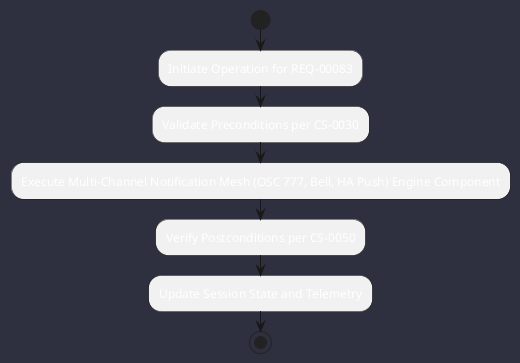

# REQ-00083: Multi-Channel Notification Mesh (OSC 777, Bell, HA Push)

## Requirement Metadata

| Property | Value |
|---|---|
| **Requirement ID** | `REQ-00083` |
| **Title** | Multi-Channel Notification Mesh (OSC 777, Bell, HA Push) |
| **Traceability** | [ADR-0042](../knowledge/knowledge_base.md) |
| **Priority** | Medium |
| **Verification Method** | Terminal Escape & Event Push Test |
| **Status** | Specified |

## Description

Omniwrench shall notify developers of task completion or clearance alerts via terminal OSC 777, ANSI bell, and Home Assistant push notifications.

## Rationale & Context

Keeps developers informed of background task progress when terminals are unfocused.

## Architecture Specification & Activity Flow

## Acceptance & Verification Criteria

1. **Functional Compliance**: The implementation satisfies all criteria defined in [ADR-0042](../knowledge/knowledge_base.md).
2. **Quality Gate**: Code conforms strictly to `CS-0010` through `CS-0070` with zero Checkstyle/PMD warnings.
3. **Automated Testing**: Covered by automated unit/integration tests verified via `Terminal Escape & Event Push Test`.
4. **Documentation**: Fully indexed in the [Requirements Register](requirements_index.md).
