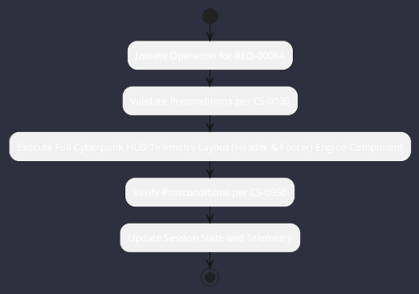

# REQ-00084: Full Cyberpunk HUD Telemetry Layout (Header & Footer)

## Requirement Metadata

| Property | Value |
|---|---|
| **Requirement ID** | `REQ-00084` |
| **Title** | Full Cyberpunk HUD Telemetry Layout (Header & Footer) |
| **Traceability** | [ADR-0043](../knowledge/knowledge_base.md) |
| **Priority** | High |
| **Verification Method** | TUI Header/Footer Widget Render Test |
| **Status** | Specified |

## Description

The TUI shall display header pills (Session, Mode, Theme, Model, Tokens) and footer status (Git, Task, Swarm, JVM, HA, FPS).

## Rationale & Context

Provides continuous situational awareness of engine and workspace state.

## Architecture Specification & Activity Flow

## Acceptance & Verification Criteria

1. **Functional Compliance**: The implementation satisfies all criteria defined in [ADR-0043](../knowledge/knowledge_base.md).
2. **Quality Gate**: Code conforms strictly to `CS-0010` through `CS-0070` with zero Checkstyle/PMD warnings.
3. **Automated Testing**: Covered by automated unit/integration tests verified via `TUI Header/Footer Widget Render Test`.
4. **Documentation**: Fully indexed in the [Requirements Register](requirements_index.md).
