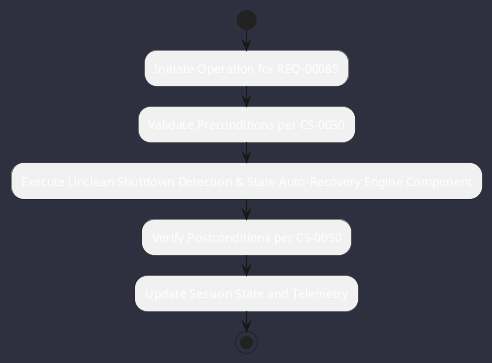

# REQ-00085: Unclean Shutdown Detection & State Auto-Recovery

## Requirement Metadata

| Property | Value |
|---|---|
| **Requirement ID** | `REQ-00085` |
| **Title** | Unclean Shutdown Detection & State Auto-Recovery |
| **Traceability** | [ADR-0044](../knowledge/knowledge_base.md) |
| **Priority** | Critical |
| **Verification Method** | Crash Lockfile & Resume State Test |
| **Status** | Specified |

## Description

Startup shall detect stale active.lock files, prompt for recovery, and restore exact conversation turns and in-flight task DAG state.

## Rationale & Context

Ensures zero work loss across unexpected crashes or power failures.

## Architecture Specification & Activity Flow

## Acceptance & Verification Criteria

1. **Functional Compliance**: The implementation satisfies all criteria defined in [ADR-0044](../knowledge/knowledge_base.md).
2. **Quality Gate**: Code conforms strictly to `CS-0010` through `CS-0070` with zero Checkstyle/PMD warnings.
3. **Automated Testing**: Covered by automated unit/integration tests verified via `Crash Lockfile & Resume State Test`.
4. **Documentation**: Fully indexed in the [Requirements Register](requirements_index.md).
