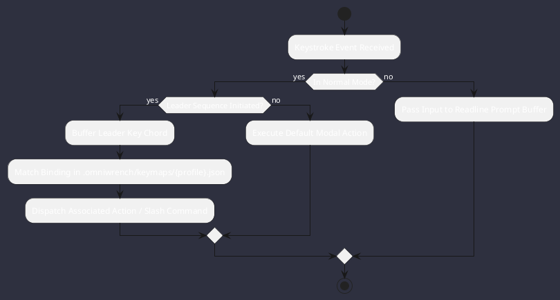

# REQ-00086: User-Configurable JSON Keymap Overrides & Leader Key Engine

## Requirement Metadata

| Property | Value |
|---|---|
| **Requirement ID** | `REQ-00086` |
| **Title** | User-Configurable JSON Keymap Overrides & Leader Key Engine |
| **Traceability** | [ADR-0045](../knowledge/knowledge_base.md) |
| **Priority** | High |
| **Verification Method** | Automated Keymap Parser & Dispatcher Test |
| **Status** | Specified |

## Description

The TUI shall support user-defined keymap configuration files in `.omniwrench/keymaps/{profile}.json` supporting Leader key sequences (e.g. `Space f f`), custom normal-mode mappings, and dynamic hot-reloading on file change.

## Rationale & Context

Enables developer personalization and ergonomic optimization across various hardware keyboards, terminal emulators, and muscle memory paradigms.

## Architecture Specification & Activity Flow

## Acceptance & Verification Criteria

1. **Functional Compliance**: Keymaps loaded from `.omniwrench/keymaps/{profile}.json` correctly override default bindings.
2. **Leader Key Execution**: Chained chords (e.g. `<leader>gd`) trigger target commands accurately.
3. **Quality Gate**: Code conforms strictly to `CS-0010` through `CS-0070`.
4. **Documentation**: Fully indexed in [Requirements Register](requirements_index.md).
