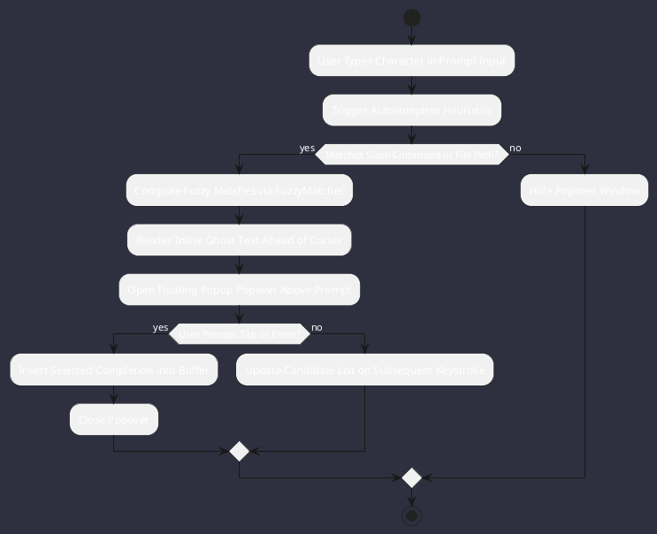

# REQ-00087: TUI Autocompletion Popover and Inline Ghost Text Engine

## Requirement Metadata

| Property | Value |
|---|---|
| **Requirement ID** | `REQ-00087` |
| **Title** | TUI Autocompletion Popover and Inline Ghost Text Engine |
| **Traceability** | [ADR-0046](../knowledge/knowledge_base.md) |
| **Priority** | High |
| **Verification Method** | Automated Fuzzy Completion & Rendering Test |
| **Status** | Specified |

## Description

The TUI prompt input component shall provide real-time inline ghost text suggestions and floating popup dropdown windows with fuzzy matching for slash commands, relative file paths, model tiers, and subagent roles.

## Rationale & Context

Significantly accelerates developer interaction speed, prevents command syntax typos, and delivers modern IDE-grade UX in a pure terminal environment.

## Architecture Specification & Activity Flow

## Acceptance & Verification Criteria

1. **Fuzzy Matching**: Candidate list correctly scores and ranks commands and files.
2. **Ghost Text**: Dimmed text displays accurately without interfering with cursor navigation.
3. **Quality Gate**: Code conforms strictly to `CS-0010` through `CS-0070`.
4. **Documentation**: Fully indexed in [Requirements Register](requirements_index.md).
